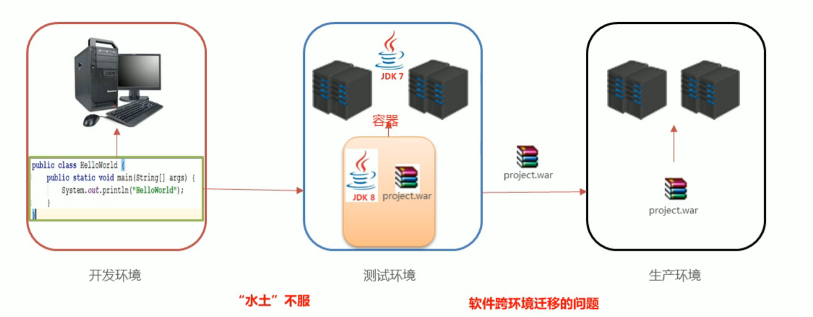
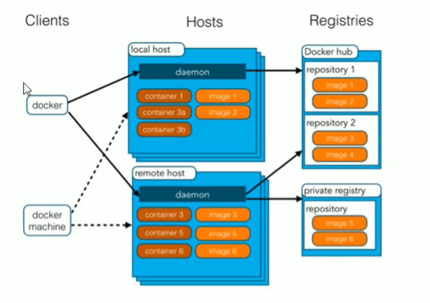
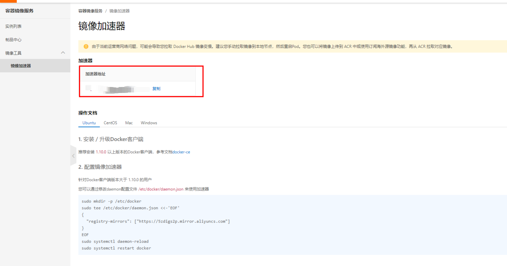

# Docker

## 初识Docker：

我们写的代码会接触到好几个环境：开发环境，测试环境，以及生产环境：

 

### Docker概念

-   Docker是一个开源的容器引擎
-   诞生于2013年初，基于Go语言实现，dotCloud公司出品（后改名为Docker Inc）
-   Docker 可以让开发这打包他们的引用以及依赖包到一个轻量级，可移植的容器中，然后发布到任何流行的Linux机器上
-   容器是完全使用沙箱机制，互相隔离
-   容器性能开销极低
-   Docker从17.03版本之后分为CE（Community Edition：社区版）和 EE（Enterprise Edition：企业版本）

$\textcolor{red}{总结：docker是一种容器技术，解决软件跨环境迁移问题}$

### 安装Docker：

Docker可运行在MAC，Windows，CentOS，UBUNTU等操作系统上

Docker：官网：https://www.docker.com/

```shell
# 1.yum 包更新到最新
yum update
#2、安装需要的软件包，yum-uti1 提供yum-config-manager 功能，另外两个是devicemapper 驱动依赖的
yum install -y yum-utils device-mapper-persistent-data lvm2
#3、设置yum源
yum-config-manager --add-repo https://download.docker.com/linux/centos/docker-ce.repo
#4、安装docker,出现输入的界面附按 y
yum install -y docker-ce
#5、查看docker版本，验证是否验证成功
docker -v
```

### Docker架构：



-   $\textcolor{red}{镜像（Image）：}$Docker镜像（Image），相当于是一个root文件系统，比如官方镜像ubuntu：16.04就包含了完整的一套Ubuntu16.04最小系统的root文件系统
-   $\textcolor{red}{容器（Container）：}$镜像（Image）和容器（Container）的关系，就像是面向对象程序涉及的类和对象一样，镜像就是静态定义，容器就是镜像运行时的实体，容器可以被创建，启动，停止，删除，暂停等。
-   $\textcolor{red}{仓库（Repository）：}$仓库可以看成一个代码控制中心，用来保存镜像

### 配置Docker镜像加速器：

默认情况下，将来从docker hub（https://hub.docker.com/）上下载docker镜像，太慢。一般都会配置镜像加速器：

-   USTC：中科大镜像加速器（https://docker.mirrors.ustc.edu.cn）
-   阿里云：
-   网易云：
-   腾讯云：



```shell
sudo mkdir -p /etc/docker
sudo tee /etc/docker/daemon.json <<-'EOF'
{
  "registry-mirrors": ["https://5zdigs2p.mirror.aliyuncs.com"]
}
EOF
sudo systemctl daemon-reload
sudo systemctl restart docker
```

## Docker命令：

