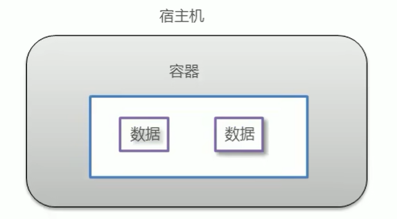
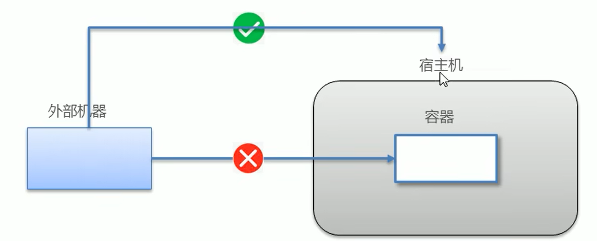
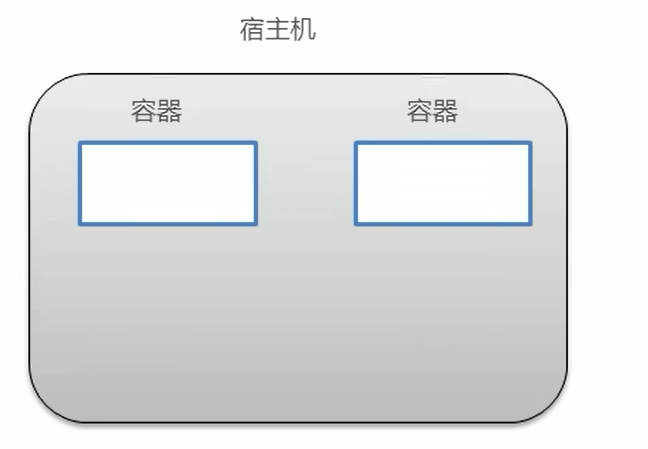
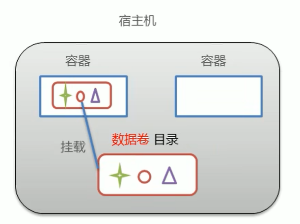
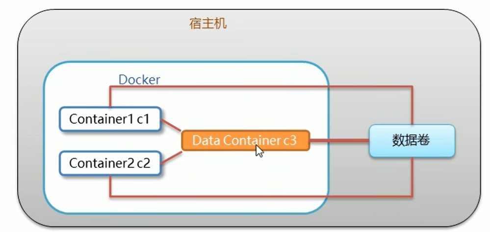
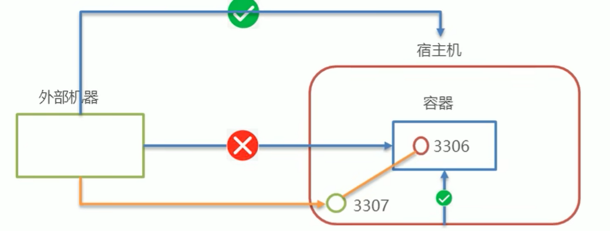

# Docker

## 初识Docker：

我们写的代码会接触到好几个环境：开发环境，测试环境，以及生产环境：

 

### Docker概念

-   Docker是一个开源的容器引擎
-   诞生于2013年初，基于Go语言实现，dotCloud公司出品（后改名为Docker Inc）
-   Docker 可以让开发这打包他们的引用以及依赖包到一个轻量级，可移植的容器中，然后发布到任何流行的Linux机器上
-   容器是完全使用沙箱机制，互相隔离
-   容器性能开销极低
-   Docker从17.03版本之后分为CE（Community Edition：社区版）和 EE（Enterprise Edition：企业版本）

$\textcolor{red}{总结：docker是一种容器技术，解决软件跨环境迁移问题}$

### 安装Docker：

Docker可运行在MAC，Windows，CentOS，UBUNTU等操作系统上

Docker：官网：https://www.docker.com/

```shell
# 1.yum 包更新到最新
yum update
#2、安装需要的软件包，yum-uti1 提供yum-config-manager 功能，另外两个是devicemapper 驱动依赖的
yum install -y yum-utils device-mapper-persistent-data lvm2
#3、设置yum源
yum-config-manager --add-repo https://download.docker.com/linux/centos/docker-ce.repo
#4、安装docker,出现输入的界面附按 y
yum install -y docker-ce
#5、查看docker版本，验证是否验证成功
docker -v
```

### Docker架构：


-   $\textcolor{red}{镜像（Image）：}$Docker镜像（Image），相当于是一个root文件系统，比如官方镜像ubuntu：16.04就包含了完整的一套Ubuntu16.04最小系统的root文件系统
-   $\textcolor{red}{容器（Container）：}$镜像（Image）和容器（Container）的关系，就像是面向对象程序涉及的类和对象一样，镜像就是静态定义，容器就是镜像运行时的实体，容器可以被创建，启动，停止，删除，暂停等。
-   $\textcolor{red}{仓库（Repository）：}$仓库可以看成一个代码控制中心，用来保存镜像

### 配置Docker镜像加速器：

默认情况下，将来从docker hub（https://hub.docker.com/）上下载docker镜像，太慢。一般都会配置镜像加速器：

-   USTC：中科大镜像加速器（https://docker.mirrors.ustc.edu.cn）
-   阿里云：
-   网易云：
-   腾讯云：


```shell
sudo mkdir -p /etc/docker
sudo tee /etc/docker/daemon.json <<-'EOF'
{
  "registry-mirrors": ["https://5zdigs2p.mirror.aliyuncs.com"]
}
EOF
sudo systemctl daemon-reload
sudo systemctl restart docker
```

## Docker命令：

### 	操作服务命令：

​	启动Docker服务：

```shell
systemctl start docker 
```

​	停止Docker服务：

```shell
systemctl stop docker 
```

​	重启Docker服务：

```shell
systemctl restart docker 
```

​	查看Docker服务状态：

```shell
systemctl status docker 
```

​	开机自启动Docker服务：

```shell
systemctl enable docker 
```

### 操作镜像命令：

查看镜像：

```dockerfile
docker images
```

搜索镜像：

```dockerfile
docker search 文件名称

#例子
docker search Redis
```

拉取镜像：

https://hub.docker.com/  官方镜像网址

```dockerfile
#不写版本号  拉去的为最新的
docker pull 文件名称[:版本号]

#例子
docker pull Redis
#或
docker pull Redis:3.0
```

删除镜像：

```dockerfile
docker rmi [IMAGE ID]
#或
docker rmi 名称:版本

# 删除所有镜像
docker rmi `docker images -q`
```

### 容器操作命令：

查看容器：

```shell
docker ps  #查看正在运行
# 或
docker ps -a  #查看所有
```

创建容器：

​	参数说明：

1.   -i：保持容器运行，通常与 -t 同时使用，加入 it 这两个参数后，容器创建后自动进入容器中，退出容器后，容器自动关闭
2.  -t：为容器重新分配一个伪输入终端，通常与 -i 同时使用
3.  -d：以守护（后天）模式运行容器。创建一个容器后台运行，需要使用docker exec进入容器。退出后，容器不会关闭
4.  -it ：创建容器一般称为交互式容器， -id 创建的容器一般称为守护式容器
5.  -- name ：为创建容器命名

```shell
docker run -it --name=[自定义] [服务名称][版本] [进入容器初始化命令]

# 例子
docker run -it --name=cl centos:7 /bin/bash

#通过 it 创建的容器创建好会立马进入容器

#退出
exit

#通过 it创建的容器 使用exit 退出 会关闭进程

###############################################################################
# 第二种
# t  创建终端   d为后台运行
docker run -id --name=[自定义名称]  [服务名称]:[版本号]
```

进入容器：

```shell
docker exec -it [docker创建时自定义的名称] [进入初始化命令  /bin/bash]
```

启动容器：

```shell
docker start [创建docker自定义名称]
```

停止容器：

```shell
docker stop [创建docker自定义名称]
```

删除容器：

```shell
docker rm [CONTATNER ID]
#或
docker rm [创建docker自定义名称]
#或
docker rm `docker ps -aq` # 删除所有docker容器
```

查看容器信息：

```shell
docker inspect [CONTATNER ID]
#或
docker inspect [创建docker自定义名称]
```

## Docker容器的数据卷：

### 	数据卷概念：

​		思考：

-   Docker容器删除之后，在容器中产生的数据也会随之销毁

    

-   Docker容器和外部机器可以直接交换文件吗？（不能）

    

-   容器之间想要进行数据交互？



#### 数据卷：

-   ​	数据卷是宿主机中的一个目录或文件
-   当容器目录和数据卷目录绑定之后，对方修改会立即同步
-   一个数据卷可以被多个容器挂载
-   一个容器也可以挂载多个数据卷



#### 数据卷的作用：

-   容器数据持久化
-   外部机器和容器之间的通信
-   容器之间数据交互

### 配置数据卷：

-   创建容器时，使用-v参数设置数据卷

    ```shell
    docker run ... -v 宿主机目录（文件）：容器内目录（文件）
    ```

-   注意事项

    -   目录必须是绝对路径
    -   如果目录不存在，会自动创建
    -   可以挂载多个数据卷

### 数据卷容器：

​	多容器进行数据交换：

1.  多个容器挂载同一个数据卷（比较麻烦）
2.  数据卷容器



#### 配置数据卷容器：

1.  创建启动数据卷容器，使用-v参数设置数据卷

    ```shell
    docker run -it --name=c3 -v /volume centos:7 /bin/bash
    ```

2.  创建启动容器，使用--volumes-from参数  设置数据卷

    ```shell
    docker run -it --name=c1 --volumes-from c3 centos:7 /bin/bash
    docker run -it --name=c2 --volumes-from c3 centos:7 /bin/bash
    ```

    

## Docker应用部署：

### MySQL部署：

​	实现步骤：

1.  搜索MySQL镜像

    ```shell
    docker search mysql
    ```

2.  拉去MySQL镜像

    ```shell
    docker pull mysql:8.0
    ```

3.  创建容器

    ```shell
    #在/root目录下创建MySQL目录用于存储MySQL数据信息
    mkdir /root/mysql
    cd /root/mysql
    
    
    docker run -id \
    -p 3307:3306 \
    --name=c_mysql \
    -v $PWD/conf:/etc/mysql/conf.d \
    -v $PWD/logs:/log \
    -v $PWD/data:/var/lib/mysql \
    -e MYSQL_ROOT_PASSWORD=123456 \
    mysql:8.0
    ```

    参数说明：

    -   -p 3307:3306 ：将容器的3306端口映射到宿主机的3307端口
    -   -v $PWD/conf:/etc/mysql/conf.d：将主机当前目录下的conf/my.cnf挂载到容器的/etc/mysql/my.cnf。配置目录
    -   -v $PWD/logs:/log ：将主机当前目录下的 logs 目录挂载到容器的 /logs。日志目录
    -   -v $PWD/data:/var/lib/mysql：将主机当前目录下的data目录挂载到容器的/var/lib/mysql。数据目录
    -   -e MYSQL_ROOT_PASSWORD=123456：初始化root用户密码

4.  操作容器中的MySQL

    ```shell
    docker exec -it d_mysql /bin/bash
    
    mysql -uroot -p
    ```

​	操作注意：

-   容器内的网络服务和外部机器不能直接通信
-   外部机器和宿主机可以直接通信
-   宿主机和容器可以直接通信
-   当容器中的网络服务需要被外部机器访问时，可以将容器提供的端口映射到宿主机端口上。外部机器访问宿主机的该端口，从而间接访问容器内的服务。
-   这种操作称为：端口映射



### Tomcat部署：

### Nginx部署：

### Redis部署：
