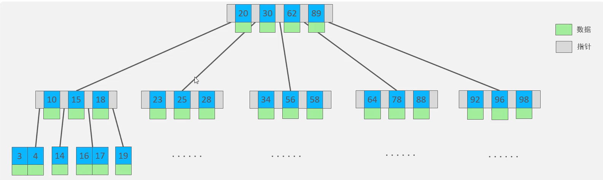

# 																																																MySQL 优化

## MySql 概述

​	数据库是 数据存储的仓库，数据有组织的进行存储   简称: DataBase（DB）

​	数据库管理系统： 操纵和管理数据库的大型软件  简称: DataBase Management System（DBMS）

​	比如: Mysql , Origin，SqlServer 都是数据库管理系统

​	通过SQL 进行操作数据库 

​	SQL ： 操作关系型数据库的编程语言，定义了一套操作关系型数据库的同意标准 Structured Query Language （SQL）

​	$\textcolor{red}{关系型数据库}$: 建立在关系模型的基础上，有多张相互链接的二维表组成的数据库

​	特点：

1. 使用表存储数据，格式统一，便于维护
2. 使用SQL 语言操作，标准统一，使用方便

   $\textcolor{red}{二维表}$：就是像Excel 表格

##  $\textcolor{red}{MySql数据模型}$


## $\textcolor{red}{SQL}$

### 	SQL通用语法:

1. 语句可以单行或者多行书写，以分号结尾
2. SQL语句可以使用空格/缩进来增强语句的可读性
3. MySQL数据库的SQL语句不区分大小写，关键字建议使用大写
4. 注释:
    - 单行注释：--注释内容 或者 #注释内容
    - 多行注释：/* 注释内容 */

### 	SQL分类：

1. DDL：Data Definition Language 数据定义语言，用来定义数据库对象（数据库，表，字段）
2. DML：Data Manipulation Language 数据操作语言,用来对数据库表中的数据进行增删改
3. DQL：Data Query Language 数据库查询语言，用来查询数据库表中的记录
4. DCL：Data Control Language 数据控制语言，用来创建数据库用户，控制数据库的访问权限

### 	DDL：

- 查询

    - 查询所有数据库

        ```sql
        SHOW DATABASES ;
        ```

    - 查询当前数据库

        ```sql
        SELECT DATABASE();
        ```

    - 创建

        ```sql
        CREATE DATABASE IF NOT EXISTS 数据库名称 DEFAULT CHAR SET 字符集 COLLATE 排序规则;
        字符集 utf8mb4 占用四个字节 默认是三个字节
        ```

    - 删除

        ```sql
        DROP DATABASE IF EXISTS 数据库名称;
        ```

    - 使用

        ```sql
        USE 数据库名称;
        ```

    - 查询当前数据库所有表

        ```sql
        SHOW TABLES;
        ```

    - 查询表结构

        ```sql
        DESC 表名称;
        ```

    - 查询指定表的创建语句

        ```sql
        SHOW CREATE TABLE 表名称;
        ```

    - 表操作-创建

        ```sql
        CREATE TABLE 表名称(
            字段 类型 COMMENT'字段注释'
        ) COMMENT '表注释';
        ```


### 		数值类型

| 分类     | 类型         | 大小    | 有符号（SIGNED）范围                                    | 无符号(UNSIGNED)范围                                       | 描述                 |
| :------- | :----------- | :------ | :------------------------------------------------------ | :--------------------------------------------------------- | :------------------- |
| 数值类型 | TINYINT      | 1 byte  | (-128,127)                                              | （0-255）                                                  | 小整数值             |
| 数值类型 | SMALLINT     | 2 byte  | (-32768,32767)                                          | （0-65535）                                                | 大整数值             |
| 数值类型 | MEDIUMINT    | 3 byte  | (-8388608,8388607)                                      | （0-16777215）                                             | 大整数值             |
| 数值类型 | INT或INTEGER | 4 byte  | (-2147483648,2147483647)                                | （0-4294967295）                                           | 大整数值             |
| 数值类型 | BIGINT       | 8 byte  | (-2^63, 2^63-1)                                         | （0-2^64-1）                                               | 极大整数值           |
| 数值类型 | FLOAT        | 4 byte  | (-3.402823466E+38,3.402823466351E+38)                   | 0 和 （1.75494351 E-38, 3.402823466 E+38）                 | 单精度浮点数值       |
| 数值类型 | DOUBLE       | 8  byte | (-1.7976931348623157E+308,1.7976931348623157E+308)jeitu | 0 和（2.2250738585072014 E-308, 1.7976931348623157 E+308） | 双精度浮点数值       |
| 数值类型 | DECIMAL      |         | 依赖于M（精度）和D（标度）的值                          | 依赖于M（精度）和D（标度）的值                             | 小数值（精确定点数） |

### 		字符串类型

| 分类       | 类型       | 大小               | 描述                         |
| ---------- | ---------- | ------------------ | ---------------------------- |
|            | CHAR       | 0-255 bytes        | 定长字符串 性能高            |     | VARCHAR    | 0-65535 bytes      | 变长字符串 性能差            |
|            | TINYBLOB   | 0-255 bytes        | 不超过255个字符的二进制数据  |
|            | TINYTEXT   | 0-255 bytes        | 短文本字符串                 |
|            | BLOB       | 0-65 535 bytes     | 二进制形式的长文本数据       |
| 字符串类型 | TEXT       | 0-65 535 bytes     | 长文本数据                   |
|            | MEDIUMBLOB | 0-16777215 bytes   | 二进制形式的中等长度文本数据 |
|            | MEDIUMTEXT | 0-16777215 bytes   | 中等长度文本数据             |
|            | LONGBLOB   | 0-4294967295 bytes | 二进制形式的极大文本数据     |
|            | LONGTEXT   | 0-4294967295 bytes | 极大文本数据                 |

### 		时间类型

​	

| 分类     | 类型      | 大小 | 范围                                       | 格式                 | 描述                     |
| -------- | --------- | ---- | ------------------------------------------ | -------------------- | ------------------------ |
|          | DATE      | 3    | 1000-01-01 至 9999-12-31                   | YYYY-MM-DD           | 日期值                   |
|          | TIME      | 3    | -838:59:59 至 838:59:59                    | HH:MM:SS             | 时间值或持续时间         |
| 日期类型 | YEAR      | 1    | 1901 至 2155                               | YYYY                 | 年份值                   |
|          | DATETIME  | 8    | 1000-01-01 00:00:00 至 9999-12-31 23:59:59 | YYYY-MM-DD  HH:MM:SS | 混合日期和时间值         |
|          | TIMESTAMP | 4    | 1970-01-01 00:00:01 至 2038-01-19 03:14:07 | YYYY-MM-DD  HH:MM:SS | 混合日期和时间值，时间戳 |

- 表操作-修改

    - 添加字段

        ```sql
        ALTER TABLE 表名 ADD 字段名称 类型(长度) COMMENT'注释' 约束;
        ```

    - 修改数据类型

        ```sql
        ALTER TABLE 表名 MODIFY 字段名 新数据类型(长度)
        ```

    - 修改字段名和字段类型

        ```sql
        ALTER TABLE 表名 CHANGE 旧表名 新表名 类型(长度) COMMENT '注释' 约束
        ```

    - 删除字段

        ```sql
        ALTER TABLE 表名 DROP 字段名 ;
        ```

    - 修改表名

        ```sql
        ALTER TABLE 表名 RENAME TO 新表名;
        ```

### DML：

- 添加单行数据

    ```sql
    INSERT INTO 表名 VALUES (字段1值，字段2值);
    
    INSERT INTO 表名(字段1,字段2) VALUES (字段1值，字段2值);
    ```

- 添加多行数据

    ```sql
    INSERT INTO 表名(字段1,字段2) VALUES (字段1值，字段2值),(字段1值，字段2值);
    ```

- 修改数据

    ```sql
     UPDATE 表名 SET 字段=修改值 WHERE 修改条件
    ```

- 删除数据

    ```sql
    DELETE FROM 表名 WHERE 修改条件
    ```

### DQL：

- 关键字 为 SELECT

    ```sql
    SELECT
        字段列表
    FROM
        表名
    WHERE
        条件列表
    GROUP BY
        分组列表
    HAVING
        分组后列表条件
    ORDER BY
        排序列表
    LIMIT
        分页列表
    ```

- 查询多个字段

    ```sql
    SELECT 字段1,字段2,字段3....FROM 表明;
    
    SELECT * FROM 表明;
    ```

- 设置别名

    ```sql
    SELECT 字段1[AS 别名1],字段2[AS 别名2]... FROM 表明;
    ```

- 去除重复记录

    ```sql
    SELECT DISTINCT 字段列表 FROM 表明;
    ```

#### **DQL-条件查询**

- 语法：

    ```sql
    SELECT 字段列表 FROM WHERE 条件列表;
    ```

- 条件

    | 比较运算符        | 功能                                   | 逻辑运算符 | 功能                     |
    | ----------------- | -------------------------------------- | ---------- | ------------------------ |
    | \>                | 大于                                   | AND 或 &&  | 并且（多个条件同事成立） |
    | \>=               | 大于等于                               | OR 或 \|\| | 或者（多个条件任意成立） |
    | <                 | 小于                                   | NOT 或  !  | 非，不是                 |
    | <=                | 小于等于                               |            |                          |
    | =                 | 等于                                   |            |                          |
    | <> 或 !=          | 不等于                                 |            |                          |
    | BETWEEN...AND.... | 在某个范围之内(含最小,最大值)          |            |                          |
    | IN(....)          | 在in之后的列表中的值，多选一           |            |                          |
    | LIKE 占位符       | 模糊匹配(_匹配单个字符，%匹配任意字符) |            |                          |
    | IS NULL           | 是NULL                                 |            |                          |

#### DQL-聚合函数

- 介绍

    - 将一列数据作为以一个整体，进行纵向计算

- 常见的聚合函数

    | 函数  | 功能     |
    | ----- | -------- |
    | count | 统计数量 |
    | max   | 最大值   |
    | min   | 最小值   |
    | avg   | 平均值   |
    | sum   | 求和     |

- 语法

    ```sql
    SELECT 聚合函数(字段列表) FROM 表名;
    
    注意: null值不参与所有聚合函数的运算
    ```

#### DQL-分组查询

- 语法

    ```sql
    SELECT 字段列表 FROM 表名 WHERE 条件 GROUP BY 分组字段名 HAVING 分组后的过滤条件;
    ```

- WHERE 和	HAVING 的区别

    - 执行时机不同：where 是分组之前进行过滤，不满足where的条件，不参与分组；而having是分组之后对结果进行过滤的
    - 判断条件不同：where不能对聚合函数进行判断，而having可以 
    - 注意
        - 执行顺序：where >聚合函数 >having
        - 分组之后：查询的字段一般为聚合函数和分组字段，查询其他字段无任何意义

#### DQL-排序查询

- 语法

    ```sql
    SELECT 字段列表 FROM 表名 ORDER BY 字段1 排序方式1，字段2 排序方式2;
    ```

- 排序方式

    - ASC：升序（默认）

    - DESC：降序

        $\textcolor{red}{注意：如果是多个字段排序，当第一个字段值相同时，才会根据第二个字段进行排序}$

#### DQL-分页查询

- 语法

    ```sql
    SELECT 字段列表 FROM 表名 LIMIT 起始索引,查询记录数;
    ```

- 注意

    - 起始索引从0开始，起始索引=（查询页码-1）*每页显示的记录数
    - 分页查询是数据库的方言，不同数据库有不同的实现，Mysql中是LIMIT
    - 如果查询的是第一页数据，起始索引可以省略，直接简写为LIMIT 10

#### DQL-执行顺序：


### DCL-介绍：

- DCL：Data Control Language 数据控制语言，用来创建数据库用户，控制数据库的访问权限

#### DCL-管理用户

- 查询用户

    ```sql
    USE mysql
    SELECT * FROM user;
    ```

- 创建用户

    ```sql
    CREATE USER '用户名'@'主机名' IDENTIFIED BY '密码';
    ```

- 修改用户密码

    ```sql
    ALTER USER '用户名'@'主机名' IDENTIFIED WITH mysql_native_password BY '新密码';
    ```

- 删除用户

    ```sql
    DROP USER '用户名'@'主机名';
    ```

- 注意

    - 主机名可以使用 % 通配
    - 这类SQL开发人员操作的比较少，主要是DBA（Database Administrator 数据管理员）使用

#### DCL-权限控制

- MySQL中定义了许多种权限，但常用的就是以下几种：

    | 权限               | 说明             |
    | :----------------- | :--------------- |
    | ALL,ALL PRIVILEGES | 所有权限         |
    | SELECT             | 查询数据         |
    | INSERT             | 播入数据         |
    | UPDATE             | 修改数据         |
    | DELETE             | 刪除数据         |
    | ALTER              | 修改表           |
    | DROP               | 除数据库/表/视图 |
    | CREATE             | 创建数据库/表    |

- 查询权限

    ```sql
    SHOW GRANTS FOR '用户名'@'主机';
    ```

- 授予权限

    ```sql
    GRANT 权限列表 ON 数据库名称.表名 TO '用户名'@‘'主机名';
    ```

- 撤销权限

    ```sql
    REVOKE 权限列表 ON 数据库名称.表名 FROM '用户名'@'主机名';
    ```

### 函数：

​	函数：是指一段可以直接被另一段程序调用的程序或代码。

1. 字符串函数
2. 数值函数
3. 日期函数
4. 流程函数

#### 字符串函数：

​	MySQL中内置了很多的字符串函数,常用的几个如下：

| 函数                     | 功能                                                      |
| ------------------------ | --------------------------------------------------------- |
| CONCAT(S1,S2,...Sn)      | 字符串拼接，将51,52，.Sn拼接成一个字符串                  |
| LOWER(str)               | 将字符串str全部转为小写                                   |
| UPPER(str)               | 将字符串str全部转为大写                                   |
| LPAD(str,n,pad)          | 左填充，用字符串pad对str的左边进行填充，达到n个字符串长度 |
| RPAD(str,n,pad)          | 右填充，用字符串pad对st的右边进行填充，达到n个字符串长度  |
| TRIM(str)                | 去掉字符串头部和尾部的空格                                |
| SUBSTRING(str,start,len) | 返回从字符串str从sart位置起的len个长度的字符串            |

​	语法

```sql
SELECT 函数(参数);
```

#### 数值函数：

​	常见的数值函数如下：

| 函数       | 函数                              |
| ---------- | --------------------------------- |
| CEIL(x)    | 向上取整                          |
| FLOOR(X)   | 向下取整                          |
| MOD(x,y)   | 返回x/y的模                       |
| RAND()     | 返回01内的随机数                  |
| ROUND(x,y) | 求参数的四舍五入的值，保留y位小数 |

#### 日期函数：

​	常见的日期函数如下：

| 函数                              | 功能                                             |
| --------------------------------- | ------------------------------------------------ |
| CURDATE()                         | 返回当前日期                                     |
| CURTIME()                         | 返回当前时间                                     |
| NOW()                             | 返回当前日期和时间                               |
| YEAR(date)                        | 获取指定date的年份                               |
| MONTH(date)                       | 获取指定date的月份                               |
| DAY(date)                         | 获取指定date的日期                               |
| DATE_ADD(date,INTERVAL expr type) | 返回一个日期/时间值加上一个时间间隔xpr后的时间值 |
| DAILDIFF(date1,dale2)             | 返回起始时间dle1和结束时间dale2之间的天数        |

#### 流程函数：

​	流程函数也是一类函数，可以在SQL语句中实现条件筛选，从而提高语句的效率

| 函数                                                  | 功能                                               |
| ----------------------------------------------------- | -------------------------------------------------- |
| IF(value,t,f)                                         | 如果alue为tue,则返回t,否则返回f                    |
| IFNULL(valuel value2)                                 | 如果value1不为空，返回value1,否则返回alue2         |
| CASE WHEN [val1 J THEN [res1]..ELSE default END       | 如果valT为true,返回es1,.否则返回detaut默认值       |
| CASE expr」WHEN [val1」THEN [res1]..ELSE default」END | 如果epr的值等于all,返回resl,.否则返回default默认值 |

### 约束

​	概述：约束是作用于表中字段上的规则，用于限制存储在表中的数据。

​	目的：保证数据库中数据的正确，有效性和完整性。

​	分类：

| 约束                    | 描述                                                     | 关键字      |
| ----------------------- | -------------------------------------------------------- | ----------- |
| 非空约束                | 限制该字段的数据不能为null                               | NOT NULL    |
| 唯一约束                | 保证该字段的所有数据鄂是唯一、不重复的                   | UNIQUE      |
| 主键约束                | 主键是一行数据的难一标识，要求非空且唯一                 | PRIMARY KEY |
| 默认约束                | 保存数据时，如果未指定该字段的值，则采用默认值           | DFFAULT     |
| 检查约束8.0.16版本之后) | 保证字段值满足某一个条件                                 | CHECK       |
| 外键约束                | 用来让两张表的数据之间建立连接，保证数据的一致性和完整性 | FORFIGN KFY |

$\textcolor{red}{注意：约束时作用与表中字段上的，可以在创建表/修改表的时候添加约束}$

语法：

```sql
CREATE TABLE 表名(
    字段 类型 约束 COMMENT'注释'
)COMMENT '注释';
```

#### 外键约束：

​	概念：外键用来让两张表的数据之间建立链接，从而保证数据的一致性和完整性


#### 语法：

##### 		添加外键

```sql
#创建表的时候
CREATE TABLE tb_user(
    字段名 数据类型,
    CONSTRAINT 外键名称 FOREIGN KEY (外键字段名) REFERENCES 主表(主表列名)
) COMMENT '注释';


修改表结构
ALTER TABLE 表名 ADD CONSTRAINT 外键名称 FOREIGN KEY (外键字段名) REFERENCES 主表(主表列名);
```

##### 		删除外键

```sql
ALTER TABLE 表名 DROP FOREIGN KEY 外键名称;
```

##### 		删除/更新行为

| 行为        | 说明                                                         |
| ----------- | ------------------------------------------------------------ |
| NO ACTION   | 当在父表中删除/更新对应记录时，首先检查该记录是否有对应外键，如果有则不允许删除/更新。（与RESTRICT一致） |
| RESTRICT    | 当在父表中删除/更新对应记录时，首先检查该记录是否有对应外键，如果有则不允许删除/更新。（与NO ACTION一致） |
| CASCADE     | 当在父表中删除/更新对应记录时，首先检查该记录是否有对应外键，如果有，则也删除更新外键在子表中的记录。 |
| SET NULL    | 当在父表中删除对应记录时，首先检查该记录是否有对应外键，如果有则设置子表中该外键值为null(这就要求该外键允许取ull) |
| SET DEFAULT | 父表有变更时，子表将外键列设置成一个默认的值(Innodb不支持)   |

```sql
ALTER TABLE 表名 ADD CONSTRAINT 外键名称 FOREIGN KEY (外键字段名) REFERENCES 主表(主表列名) ON UPDATE CASCADE ON DELETE CASCADE;


# SET NULL 的约束
ALTER TABLE 表名 ADD CONSTRAINT 外键名称 FOREIGN KEY (外键字段名) REFERENCES 主表(主表列名) ON UPDATE SET NULL ON DELETE SET NULL ;
```

### 多表查询

#### 	多表关系

​		概述：

项目开发中，在进行数据库表结构设计时，会根据业务需求及业务模块之间的关系，分析并设计表结构，由于业务之间相互关联，所以各个表结构之间也存在着各种联系，基本上分为三种：

1. 一对多（多对一）

    1. 案例：部门与员工的关系
    2. 关系：一个部门对应多个员工，一个员工对应一个部门
    3. 实现：在多的一方建立外键，指向一的一方的主键

    

2. 多对多

    1. 案例：学生与课程的关系

    2. 关系：一个学生可以选修多门课程，一门课程也可以提供多个学生选择

    3. 实现：建立第三张中间表，中间表至少包含两个外键，分别关联两方的主键

        

3. 一对一

    1. 案例：用户与用户详情的关系

    2. 关系：一对一关系，多用于单表拆分，将一张表的基础字段放在一张表中，其他详情字段放在另一张表中，以提升操作效率

    3. 实现：在任意一方加入外键，关联另一方的主键，并且设置外键为唯一的（UNIQUE）

        

#### 多表查询

​	概述：指从多张表中查询数据

​	笛卡尔积：笛卡尔积是指在数学中，两个集合A集合和B集合的所有组合情况（在多表查询时，需要消除无效的笛卡尔积）


#### 多表查询分类

1. 连接查询

    1. 内连接：相当于查询A，B交集部分数据
    2. 外连接
        1. 左外连接：查询左表所有数据，以及两张表交集部分数据
        2. 右外连接：查询右表所有数据，以及两张表交集部分数据
    3. 自连接：当前表与自身的连接查询，自连接不许使用表别名

2. 子查询

    1. 连接查询-内连接

        1. 内连接查询语法

            1. 隐式查询

                ```sql
                SELECT 字段列表 FROM 表1,表2 WHERE 连接条件（表的主外键）;
                ```

            2. 显示查询

                ```sql
                SELECT 字段列表 FROM 表1 别名 INNER JOIN 表2 别名 ON 连接条件（表的主外键）;
                
                可以省略 INNER
                ```

        2. $\textcolor{red}{内连接查询的是两张表交集的部分}$

            

    2. 连接查询-外连接

        1. 连接查询语法

            1. 左外连接

                ```sql
                SELECT 字段列表 FROM 表1 别名 LEFT JOIN 表2 别名 ON 连接条件（表的主外键）;
                
                SELECT 字段列表 FROM 表1 别名 LEFT OUTER JOIN 表2 别名 ON 连接条件（表的主外键）;
                可以省略 OUTER
                ```

                $\textcolor{red}{相当于查询表1（左表）的所有数据 包含 表1和表2交集的部分的数据}$

            2. 右连接

                ```sql
                SELECT 字段列表 FROM 表1 别名 RIGHT JOIN 表2 别名 ON 连接条件（表的主外键）;
                
                SELECT 字段列表 FROM 表1 别名 RIGHT OUTER JOIN 表2 别名 ON 连接条件（表的主外键）;
                可以省略 OUTER
                ```

                $\textcolor{red}{相当于查询表2（右表）的所有数据 包含 表1和表2交集的部分的数据}$

    3. 连接查询-自连接

        1. 自连接查询语法：

            ```sql
            SELECT 字段列表 FROM 表A 别名 JOIN 表A 别名 ON 连接条件;
            SELECT 字段列表 FROM 表A 别名 , 表A 别名 WHERE 连接条件;
            
            -- 外连接
            SELECT 字段列表 FROM 表A 别名 LEFT JOIN 表A 别名 ON 连接条件;
            SELECT 字段列表 FROM 表A 别名 RIGHT JOIN 表A 别名 ON 连接条件;
            ```

            $\textcolor{red}{自连接查询，可以是内连接查询，也可以是外连接查询}$

    4. 联合查询-union，union all

        1. 概述：对于union查询，就是把多次查询的结果合并起来，形成一个新的查询结果集。

        2. 语法

            ```sql
            SELECT 字段列表 FROM 表A
            UNION
            SELECT 字段列表 FROM 表B;
            -- 给查询的结果合并之后去重
            -- 或者
            SELECT 字段列表 FROM 表A
            UNION ALL
            SELECT 字段列表 FROM 表B;
            --直接查询全部结果
            ```

            $\textcolor{red}{对于联合查询的多张表的列数必须保持一直，字段类型也需要保持一致}$

            $\textcolor{red}{UNION ALL 会将全部的数据直接合并在一起，UNION会对合并之后的数据去重}$

3. 子查询

    1. 概述：SQL语句中嵌套SELECT语句，称为嵌套查询，又称子查询

        ```sql
        SELECT * FROM 表1 WHERE 列名 = (SELECT 列名 FROM 表2)
        ```

        $\textcolor{red}{子查询外部的语句可以是INSERT / UPDATE / DELECT / SELECT 的任何一个}$

    2. 根据子查询的结果不同，分为：

        - 标量子查询（子查询结果值为单个值）
        - 列子查询（子查询的结果为一列）
        - 行子查询（子查询的结果为一行）
        - 表子查询（子查询的结果为多列）

    3. 根据子查询位置，分为：WHERE之后，FROM之后，SELECT之后

    4. 子查询

        1. 标量子查询

            1. 概述：子查询返回的结果是单个值（数字，字符串，日期等），最简单的形式，这种子查询称为标量子查询

            2. 常用的操作符：=  	<>		>	>=	<		<=

            3. 语法：

                ```sql
                SELECT * FROM 表1 WHERE 列名 = (SELECT 列名 FROM 表2 WHERE 条件);
                SELECT * FROM 表1 WHERE 列名 <> (SELECT 列名 FROM 表2 WHERE 条件);
                SELECT * FROM 表1 WHERE 列名 > (SELECT 列名 FROM 表2 WHERE 条件);
                SELECT * FROM 表1 WHERE 列名 >= (SELECT 列名 FROM 表2 WHERE 条件);
                SELECT * FROM 表1 WHERE 列名 < (SELECT 列名 FROM 表2 WHERE 条件);
                SELECT * FROM 表1 WHERE 列名 <= (SELECT 列名 FROM 表2 WHERE 条件);
                ```

        2. 列子查询

            1. 概述：子查询返回的结果是一列（可以是多行），这种子查询称为列子查询

            2. 常用的操作符：IN		NOT IN		ANY			SOME		ALL	

                | 操作符 | 描述                                   |
                | ------ | -------------------------------------- |
                | IN     | 在指定的集合范围之内，多选一           |
                | NOT IN | 不在指定的集合范围之内                 |
                | ANY    | 子查询返回列表中，有任意一个满足即可   |
                | SOME   | 与ANY等同，使用SOME的地方都可以使用ANY |
                | ALL    | 子查询返回列表的所有值都必须满足       |

            3. 语法：

                ```sql
                SELECT * FROM 表1 WHERE 列名 IN (SELECT 列名 FROM 表2 WHERE 条件1);
                
                SELECT * FROM 表1 WHERE 列名 > ALL (SELECT 列名 FROM 表2 WHERE 条件1);
                
                SELECT * FROM 表1 WHERE 列名 > ANY (SELECT 列名 FROM 表2 WHERE 条件1);
                
                SELECT * FROM 表1 WHERE 列名 > SOME (SELECT 列名 FROM 表2 WHERE 条件1);
                ```

        3. 行子查询：

            1. 概述：子查询的返回结果返回的结果是一行（可以是多列），这种子查询称为行字查询

            2. 常用的操作符：=	<>	IN	NOT	IN

                ```sql
                SELECT 列名 FROM 表名 WHERE (条件1,条件2) = (SELECT 条件1列名,条件2列名 FROM 表名 WHERE 删选条件)
                ```

        4. 表字查询：

            1. 概述：子查询返回的结果是多行多列，这种子查询称为表子查询

            2. 常用的操作符：IN

                ```
                SELECT 列名 FROM 表名 WHERE(条件1,条件2) IN (SELECT 条件1列名,条件2列名 FROM 表名 WHERE 筛选条件)
                
                SELECT 列名 FROM (SELECT 列名 FROM 表名 WHERE 筛选条件) 别名 LEFT JOIN 连接条件
                ```

### 事务：

​	事务是一组操作的集合，他是一个不可分割的工作单位，事务会把所有的操作作为一个整体一起向系统提交或撤销操作请求，即这些操作要么同时成功，要么同时失败


​	默认MySQL的事务是自动提交的，也就是说，当执行一条DML语句，MySQL会立即隐式提交事务

#### 	事务操作：

1. 查看/设置事务提交方式

    ```sql
    SELECT @@autocommit;
    
    SET @@autocommit=0;
    ```

2. 提交事务

    ```sql
    COMMIT;
    ```

3. 回滚事务

    ```sql
    ROLLBACK;
    ```

4. 开启事务

    ```sql
    SELECT TSTART TRANSACTION 或者 BEGIN
    ```

#### 事务的四大特性：

​	原子性(Atomicity)：事务是不可分割的最小操作单元，要么全部成功，要么全部失败。

​	一致性(Consistency)：事务完成时，必须使所有的数据都保持一致状态。

​	隔离性(Isolation)：数据库系统提供的隔离机制，保证事务在不受外部并发操作影响的独立环境下运行。

​	持久性(Durability)：事务一旦提交或回滚，它对数据库中的数据的改变就是永久的。

#### 并发事务问题：

| 问题       | 描述                                                         |
| ---------- | ------------------------------------------------------------ |
| 脏读       | 一个事务读到另外一个事务还没有提交的数据。                   |
| 不可重复读 | 一个事务先后读取同一条记录，但两次读取的数据不同，称之为不可重复读。 |
| 幻读       | 一个事务按照条件查询数据时，没有对应的数据行，但是在插入数据时，又发现这行数据已经存在，好像出现了幻影”。 |


#### 	事务的隔离级别：

| 隔离级别                               | 脏读 | 不可重复读 | 幻读 |
| -------------------------------------- | ---- | ---------- | ---- |
| Read uncommitted（性能高，数据不安全） | √    | √          | √    |
| Read committed                         | ×    | √          | √    |
| Repeatable Read(默认)                  | ×    | ×          | √    |
| Serializable（性能差，数据安全）       | ×    | ×          | ×    |

​	查看事务隔离级别

```sql
SELECT @@TRANSACTION_ISOLATION;
```

​	设置事务隔离级别

```sql
SET [SESSION | GLOBAL] TRANSACTION ISOLATION LEVEL {READ UNCOMMITTED | READ COMMITTED | REPEATABLE READ | SERIALIZABLE}
```

$\textcolor{red}{注意：事务的隔离级别越高，数据越安全，但是性能越低。}$

## MySQL存储引擎

### 	MySQL体系结构：


1. **连接层**

    最上层是一些客户端和链接服务，主要完成一些类似于连接处理、授权认证、及相关的安全方案。服务器也会为安全接入的每个客户端验证它所具有的操作权限。

2. **服务层**

    第二层架构主要完成大多数的核心服务功能，如SQL接口，并完成缓存的查询，SQL的分析和优化，部分内置函数的执行。所有跨存储引擎的功能也在这一层实现，如过程、函数等。

3. **引擎层**

    存储引擎真正的负责了MySQL中数据的存储和提取，服务器通过API和存储引擎进行通信。不同的存储引擎具有不同的功能，这样我们可以根据自己的需要，来选取合适的存储引擎。

4. **存储层**

    主要是将数据存储在文件系统之上，并完成与存储引擎的交互。

### 存储引擎简介：

​	存储引擎就是存储数据、建立索引、更新/查询数据等技术的实现方式。存储引擎是基于表的，而不是基于库的，所以存储引擎也可被称为表类型。

​	在创建表的时候，指定存储引擎

```sql
CREATE TABLE 表名(
    字段 类型 COMMENT '注释',
    字段 类型 COMMENT '注释'
) ENGINE = 存储引擎 COMMENT '注释';
```

​	查看当前数据开支持的存储引擎

```sql
OW ENGINES;
```

### 存储引擎特点：

​	介绍：

​		INNODB是一中兼顾高可靠性和高性能的通用存储引擎，在MySQL5.5之后，INNODB是默认的MySQL存储引擎。

​	特点：

​		DML操作遵循ACID模型，支持$\textcolor{rgb(255, 153, 1)}{事务}$

​		$\textcolor{rgb(255, 153, 1)}{行级锁}$，提高并发访问性能

​		支持$\textcolor{rgb(255, 153, 1)}{外键}$FOREIGN KEY约束，保证数据的完整性和正确性

​	文件：

​		xxx.ibd：xxx代表的是表名，innoDB引擎的每张表都会有这样一个空间文件，存储该表的表结构（frm，sdi），数据引擎。

​		参数：innodb_file_per_table

```sql
# 查看表文件
SHOW VARIABLES LIKE 'innodb_file_per_table';

# 查看ibd文件内容
ibd2sdi xxx.ibd
```

#### InnoDB 逻辑结构图：


#### MyISAM：

介绍：

​	MyISAM是MySQL早期的默认引擎

特点：

​	不支持事务，不支持外键

​	支持表锁，不支持行锁

​	访问速度快

包括文件：


xxx.sdi表结构 	

xxx.MYD表数据	

xxx.MYI索引

#### Memory：

介绍：

​	Memoryi引擎的表数据是存储在内存中的，由于受到硬件问题、或断电问题的影响，只能将这些表作为临时表或缓存使用。

特点：

​	内存存放

​	hash索引（默认）

文件：

​	xxx.sdi：存储表结构信息

#### 存储引擎特点：

| 特点         | InnoDB            | MyISAM | Memory |
| ------------ | ----------------- | ------ | ------ |
| 存储限制     | 64TB              | 有     | 有     |
| 事务安全     | 支持              | \----  | \----  |
| 锁机制       | 行锁              | 表锁   | 表锁   |
| B+tree索引   | 支持              | 支持   | 支持   |
| Hash索引     | \----             | \----  | 支持   |
| 全文索引     | 支持(5.6版本之后) | 支持   | \----  |
| 空间使用     | 高                | 低     | N/A    |
| 内存使用     | 高                | 低     | 中等   |
| 批量插入速度 | 低                | 高     | 高     |
| 支持外键     | 支持              | \----  | \----  |

#### 存储引擎选择

在选择存储引擎时，应该根据应用系统的特点选择合适的存储引擎。对于复杂的应用系统，还可以根据实际情况选择多种存储引擎进行组合。

-   InnoDB：是Mysq的默认存储引擎，支持事务、外键。如果应用对事务的完整性有比较高的要求，在并发条件下要求数据的一致性，数据操作除了插入和查询之外，还包含很多的更新、删除操作，那么InnoDB存储引擎是比较合适的选择。
-   MyISAM：如果应用是以读操作和插入操作为主，只有很少的更新和删除操作，并且对事务的完整性、并发性要求不是很高，那么选择这个存储引擎是非常合适的。
-   MEMORY：将所有数据保存在内存中，访问速度快，通常用于临时表及缓存。MEMORY的缺陷就是对表的大小有限制，太大的表无法缓存在内存中，而且无法保障数据的安全性。

## 索引：

### 	概述：

​	索引（index)是帮助MySQL高效获取数据的数据结构（有序）。在数据之外，数据库系统还维护着满足特定查找算法的数据结构，这些数据结构以某种方式引用（指向）数据，这样就可以在这些数据结构上实现高级查找算法，这种数据结构就是索引。


### 优缺点：

| 优势                                                         | 劣势                                                         |
| ------------------------------------------------------------ | ------------------------------------------------------------ |
| 提高数据检索的效率，降低数据库的O成本                        | 索引列也是要占用空间的。                                     |
| 通过索引列对数据进行排序，降低数据排序的成本，降低CPU的消耗。 | 索引大大提高了查询效率，同时却也降低更新表的速度，如对表进行INSERT、UPDATE、DELETE时，效率降低。 |

### 索引结构：

MySQL的索引是在存储引擎层实现的，不同的存储引擎有不同的结构，主要包含以下几种：

| 索引结构              | 描述                                                         |
| --------------------- | ------------------------------------------------------------ |
| B+Tree索引            | 最常见的索引类型，大部分引擎都支持B+树索引                   |
| Hash索引              | 底层数据结构是用哈希表实现的，只有精确匹配索引列的查询才有效不支持范围查询 |
| R-Tree(空间索引)      | 空间索引是MyISAM引擎的一个特殊索引类型，主要用于地理空间数据类型，通常使用较少 |
| Full-text（全文索引） | 是一种通过建立倒排索引，快速匹配文档的方式。类似于Lucene,Solr,ES |

#### 索引结构：

| 索引                  | InnoDB          | MyISAM | Memory |
| --------------------- | --------------- | ------ | ------ |
| B+Tree索引            | 支持            | 支持   | 支持   |
| Hash索引              | 不支持          | 不支持 | 支持   |
| R-Tree(空间索引)      | 不支持          | 支持   | 不支持 |
| Full-text（全文索引） | 5.6版本之后支持 | 支持   | 不支持 |

$\textcolor{red}{我们平常所说的索引，如果没有特别指明，都是B+Tree结构组织的索引}$

#### 索引结构图以及演示：

二叉树：


$\textcolor{red}{二叉树缺点：顺序插入时，会形成一个链表，查询性能大大降低。大数据量情况下，层级较深，检索速度慢。}$

$\textcolor{red}{红黑树：大数据量情况下，层级较深，检索速度慢。}$

B-Tree（多路平衡查找树）：

​	以一颗最大度数（max-degree）为5（5阶）的B-Tree为例（每个节点最多存储4个Key，5个指针）

​	$\textcolor{red}{树的度数指的是一个节点的子节点个数}$



演示：

插入数据

```
插入100 65 169 368 900 556 780 35 215 1200 234 888 158 90 1000 88 120 268 250数据为例。
```

网址：https://www.cs.usfca.edu/~galles/visualization/Algorithms.html

形成裂变：中间元素向上裂变


B+Tree：

以一颗最大度数（max-degree）为4（4阶）的B+Tree为例


$\textcolor{red}{特点：}$

​	$\textcolor{red}{非叶子节点的元素起到索引的作用}$

​	$\textcolor{red}{所有的元素都会出现在叶子节点}$

​	$\textcolor{red}{叶子节点形成单项列表}$

演示：

​	添加数据

```
插入100 65 169 368 900 556 780 35 215 1200 234 888 158 90 1000 88 120 268 250数据为例。
```


### 索引结构：

#### 	MySQL中B+Tree

MySQL索引数据结构对经典的B+Tree进行了优化。在原B+Tree的基础上，增加了一个指向相邻叶子节点的链表指针，就形成了带有顺序指针的B+Tree，提高区间访问性能。


#### 	Hash：

哈希索引就是采用一定的Hash算法，将键值换算成新的Hash值，映射到对应的槽位上，然后存储在hash表中

如果两个（或多个）键值，映射到相同的槽位上，他们就产生了Hash冲突（也成为Hash碰撞），可以通过链表来解决


##### Hash索引特点：

1.  Hash索引只能用于对等比较（=，in），不支持范围查询（between，>，<，....）（因为Hash值存储的时候是没有顺序的）
2.  无法利用索引完成排序操作（因为Hash值存储的时候是没有顺序的）
3.  查询效率高，通常只通过一次检索就可以了，效率通常高于B+Tree索引（没有Hash值碰撞，会到链表中进行查找）

##### 存储引擎支持：

在MySQL中，支持Hash索引的是Memory引擎，而InnoDB中具有自适应hash功能（MySQL根据查询条件在指定的条件下会自动的将B+Tree索引构建成Hash索引），hash索引是存储引擎根据B+Tree索引指定条件下自动构建的。

##### 问什么innoDB存储引擎选择使用B+Tree？

-   相对于二叉树，层级更少，搜索效率高
-   相对于B-Tree，无论是叶子节点还是非叶子节点，都会保存数据，这样导致一页中存储的键值减少，指针跟着减少，要同样保存大量的数据，只能增加树的高度，导致性能降低
-   相对于Hash索引，B+Tree支持范围匹配及排序操作

### 索引的分类

| 分类     | 含义                                                 | 特点                     | 关键字   |
| -------- | ---------------------------------------------------- | ------------------------ | -------- |
| 主键索引 | 针对于表中主键创建的索引                             | 默认自动创建，只能有一个 | PRIMARY  |
| 唯一索引 | 避免同一个表中某数据列中的值重复                     | 可以有多个               | UNIQUE   |
| 常规索引 | 快速定位特定的数据                                   | 可以有多个               |          |
| 全文索引 | 全文索引查找的是文本中的关键词，而不是比较索引中的值 | 可以有多个               | FULLTEXT |

#### 在InnoDB存储引擎中，根据索引的存储形式，又可以分为以下两种：

| 分类                                                | 含义                                                       | 特点                 |
| --------------------------------------------------- | ---------------------------------------------------------- | -------------------- |
| 聚集索引（Clustered index）                         | 将数据存储与索引放到了一块，索引结构的叶子节点保存了行数据 | 必须有，而且只有一个 |
| 二级索引（Secondary index）（辅助索引，非聚集索引） | 将数据与索引分开存储，索引结构的叶子节点关联的是对应的主键 | 可以存在多个         |

#### 聚集索引的选取规则：

-   如果存在主键，主键索引就是聚集索引
-   如果不存在主键，将使用第一个唯一（UNIQUE）索引作为聚集索引
-   如果表中没有主键，或没有合适的唯一索引，则InnoDB会自动生成一个rowid作为隐藏的聚集索引


#### 以下那条SQL 执行效率高：

```sql
SELECT * FROM user WHERE id ='10'

SELECT * FROM user WHERE name='Arm'

备注：id为主键，name字段创建的有索引
```

#### 思考：InnoDB主键索引的B+Tree高度为多高？

提出假设：

​	一行数据大小为1k，一页中可以存储16行这样的数据。InnoDB的指针占用6个字节空间，（key）主键即使为bigint，占用8个字节。

高度为2

 n * 8+（n+1）* 6 = 16（k）* 1024（byte）算出n约为1170

### 索引语法：

-   创建索引

    ```sql
    CREATE [UNIQUE | FULLTEXT] INDEX index_name ON table_name (index_col_name,...);
    
    # ... 
    代表一个索引可以关联多个字段（称为：联合索引，组合索引）
    一个索引只关联一个字段（称为：单列索引）
    
    # index_name 规则  idx为（index 缩写）
    idx_表名_字段名
    ```

-   查看索引

    ```sql
    SHOW INDEX FROM table_name;
    
    SHOW INDEXES FROM table_name;
    
    SHOW KEYS FROM table_name;
    ```

-   删除索引

    ```sql
    DROP INDEX index_name ON table_name;
    ```

### SQL性能分析

#### 	SQL执行频率

​	MySQL客户端连接成功后，通过 SHOW [ SESSION | GLOBAL] STATUS 命令可以提供服务器状态信息，通过指令，可以查看当前数据库的INSERT，UPDATE，DELETE，SELECT 的访问频率；

```sql
# SESSION 当前会话  GLOBAL 全局状态
SHOW GLOBAL STATUS LIKE 'Com%';
#或者
SHOW GLOBAL STATUS LIKE 'Com_______';
```

#### 	慢查询日志：

慢查询日志记录了所有执行时间超过指定参数（Long_query_time，单位：秒，默认10秒）的所有SQL语句日志。

MySQL的慢查询日志默认没有开启，需要在MySQL的配置文件（/eetc/my.cnf）中配置如下信息：

```sql
#查看慢日志开启情况
SHOW VARIABLES LIKE 'slow_query_log';

#开启MySQL慢日志查询开关
slow_query_log=1
#设置慢日志的时间为2秒，SQL语句执行时间查过2秒，就会视为慢查询，记录慢查询日志
log_query_time=2
```

配置完毕之后，通过以下指令重启MySQL服务进行测试，查看慢日志文件中记录的信息/var/lib/mysql/localhost-slow.log

#### 	PROFILE详情：

SHOW PROFILES 能够在做SQL优化时帮助我们了解事件都耗在那里去了。通过HAVE_PROFILING参数，能够看到当前MySQL是否支持

PROFILE操作：

```sql
SELECT @@HAVE_PROFILING;
```

默认PROFILING是关闭的，可以通过set语句在SESSION / GLOBAL 级别开启PROFILING：

```sql
#查看开启状态 0 关闭  1 开启
SELECT @@PROFILING;

#开启开关
SET PROFILING = 1;

#查看每一条SQL的耗时基本情况
SHOW PROFILES;
#查看指定query_id的SQL语句哥哥极端的好事状况
SHOW PROFILE FOR QUERY query_id;
#查看指定query_id的SQL语句CPU的使用情况
SHOW PROFILE CPU FOR QUERY query_id;
```

#### 	EXPLAIN执行计划：

EXPLAN 或者 DESC 命令获取MySQL如何执行 SELECT 语句的信息，包括在SELECT语句执行过程中表如何连接和连接顺序。

语法：

```sql
#直接在 SELECT 语句之前加上关键字 EXPLAIN / DESC
EXPLAIN SELECT 字段列表 FROM 表名 WHERE 条件;
DESC SELECT 字段列表 FROM 表名 WHERE 条件;
```

查询出来的所有列


##### 	EXPLAIN执行计划的个字段含义：

1.  id
    1.  SELECT查询的序列号，表示查询中执行select子句或者是操作表的顺序(d相同，执行顺序从上到下；id不同，值逗大，题先执行)。
2.  select_type
    1.  SIMPLE：表示不需要[union](https://so.csdn.net/so/search?q=union&spm=1001.2101.3001.7020)操作或者不包含子查询的简单select查询。有连接查询时，外层的查询为simple，且只有一个
    2.  PRIMARY：一个需要union操作或者含有[子查询](https://so.csdn.net/so/search?q=子查询&spm=1001.2101.3001.7020)的select，位于最外层的单位查询的select_type即为primary。且只有一个
    3.  UNION：union连接的两个select查询，第一个查询是dervied派生表，除了第一个表外，第二个以后的表select_type都是union
    4.  DEPENDENT UNION：与union一样，出现在union 或union all语句中，但是这个查询要受到外部查询的影响
    5.  UNION RESULT：包含union的结果集，在union和union all语句中,因为它不需要参与查询，所以id字段为null
    6.  SUBQUERY：除了from字句中包含的子查询外，其他地方出现的子查询都可能是subquery
    7.  DEPENDENT SUBQUERY：与dependent union类似，表示这个subquery的查询要受到外部表查询的影响
    8.  DERIVED：from字句中出现的子查询，也叫做派生表，其他数据库中可能叫做内联视图或嵌套select
3.  table
    1.  显示的查询表名，如果查询使用了别名，那么这里显示的是别名，如果不涉及对数据表的操作，那么这显示为null，如果显示为尖括号括起来的就表示这个是临时表，后边的N就是执行计划中的id，表示结果来自于这个查询产生。如果是尖括号括起来的，与类似，也是一个临时表，表示这个结果来自于union查询的id为M,N的结果集。
4.  $\textcolor{red}{type}$
    1.  依次从好到差：null，system，const，eq_ref，ref，fulltext，ref_or_null，unique_subquery，index_subquery，range，index_merge，index，all，除了all之外，其他的type都可以使用到索引，除了index_merge之外，其他的type只可以用到一个索引
        1.  NULL：不查询表的时候出现
        2.  SYSTEM：表中只有一行数据或者是空表，且只能用于myisam和memory表。如果是Innodb引擎表，type列在这个情况通常都是all或者index
        3.  CONST：使用唯一索引或者主键，返回记录一定是1行记录的等值where条件时，通常type是const。其他数据库也叫做唯一索引扫描
        4.  EQ_REF：出现在要连接过个表的查询计划中，驱动表只返回一行数据，且这行数据是第二个表的主键或者唯一索引，且必须为not null，唯一索引和主键是多列时，只有所有的列都用作比较时才会出现eq_ref
        5.  REF：不像eq_ref那样要求连接顺序，也没有主键和唯一索引的要求，只要使用相等条件检索时就可能出现，常见与辅助索引的等值查找。或者多列主键、唯一索引中，使用第一个列之外的列作为等值查找也会出现，总之，返回数据不唯一的等值查找就可能出现。
        6.  FULLTEXT：全文索引检索，要注意，全文索引的优先级很高，若全文索引和普通索引同时存在时，mysql不管代价，优先选择使用全文索引
        7.  REF_OR_NULL：与ref方法类似，只是增加了null值的比较。实际用的不多。
        8.  UNIQUE_SUBQUERY：用于where中的in形式子查询，子查询返回不重复值唯一值
        9.  INDEX_SUBQUERY：用于in形式子查询使用到了辅助索引或者in常数列表，子查询可能返回重复值，可以使用索引将子查询去重。
        10.  索引范围扫描，常见于使用>
        11.  INDEX_MERGE：表示查询使用了两个以上的索引，最后取交集或者并集，常见and ，or的条件使用了不同的索引，官方排序这个在ref_or_null之后，但是实际上由于要读取所个索引，性能可能大部分时间都不如range
        12.  INDEX：索引全表扫描，把索引从头到尾扫一遍，常见于使用索引列就可以处理不需要读取数据文件的查询、可以使用索引排序或者分组的查询
        13.  ALL：这个就是全表扫描数据文件，然后再在server层进行过滤返回符合要求的记录。
5.  possible_keys
    1.  查询可能使用到的索引都会在这里列出来
6.  $\textcolor{red}{key}$
    1.  查询真正使用到的索引，select_type为index_merge时，这里可能出现两个以上的索引，其他的select_type这里只会出现一个
7.  key_len
    1.  用于处理查询的索引长度，如果是单列索引，那就整个索引长度算进去，如果是多列索引，那么查询不一定都能使用到所有的列，具体使用到了多少个列的索引，这里就会计算进去，没有使用到的列，这里不会计算进去。留意下这个列的值，算一下你的多列索引总长度就知道有没有使用到所有的列了。要注意，mysql的ICP特性使用到的索引不会计入其中。另外，key_len只计算where条件用到的索引长度，而排序和分组就算用到了索引，也不会计算到key_len中。
8.  ref
    1.  如果是使用的常数等值查询，这里会显示const，如果是连接查询，被驱动表的执行计划这里会显示驱动表的关联字段，如果是条件使用了表达式或者函数，或者条件列发生了内部隐式转换，这里可能显示为func
9.  rows
    1.  这里是执行计划中估算的扫描行数，不是精确值
10.  $\textcolor{red}{extra}$
     1.  DISTINCT：在select部分使用了distinc关键字
     2.  NO TABLES USED：不带from字句的查询或者From dual查询
     3.  使用not in()形式子查询或not exists运算符的连接查询，这种叫做反连接。即，一般连接查询是先查询内表，再查询外表，反连接就是先查询外表，再查询内表。
     4.  USING FILESORT：排序时无法使用到索引时，就会出现这个。常见于order by和group by语句中
     5.  USING INDEX：查询时不需要回表查询，直接通过索引就可以获取查询的数据。
     6.  USING JOIN BUFFER(block nested loop)，USING JOIN BUFFER(batched key accss)：5.6.x之后的版本优化关联查询的BNL，BKA特性。主要是减少内表的循环数量以及比较顺序地扫描查询。
     7.  using sort_union，using_union，using intersect，using sort_intersection：
         1.  USING INTERSECT：表示使用and的各个索引的条件时，该信息表示是从处理结果获取交集
         2.  USING UNION：表示使用or连接各个使用索引的条件时，该信息表示从处理结果获取并集
         3.  USING SORT_UNION和USING SORT_INTERSECTION：与前面两个对应的类似，只是他们是出现在用and和or查询信息量大时，先查询主键，然后进行排序合并后，才能读取记录并返回。
     8.  USING TEMPORARY：表示使用了临时表存储中间结果。临时表可以是内存临时表和磁盘临时表，执行计划中看不出来，需要查看status变量，used_tmp_table，used_tmp_disk_table才能看出来。
     9.  USING WHERE：表示存储引擎返回的记录并不是所有的都满足查询条件，需要在server层进行过滤。查询条件中分为限制条件和检查条件，5.6之前，存储引擎只能根据限制条件扫描数据并返回，然后server层根据检查条件进行过滤再返回真正符合查询的数据。5.6.x之后支持ICP特性，可以把检查条件也下推到存储引擎层，不符合检查条件和限制条件的数据，直接不读取，这样就大大减少了存储引擎扫描的记录数量。extra列显示using index condition
     10.  FIRSTMATCH(tb_name)：5.6.x开始引入的优化子查询的新特性之一，常见于where字句含有in()类型的子查询。如果内表的数据量比较大，就可能出现这个
     11.  LOOSESCAN(m..n)：5.6.x之后引入的优化子查询的新特性之一，在in()类型的子查询中，子查询返回的可能有重复记录时，就可能出现这个
     12.  除了这些之外，还有很多查询数据字典库，执行计划过程中就发现不可能存在结果的一些提示信息
11.  filtered
     1.  使用explain extended时会出现这个列，5.7之后的版本默认就有这个字段，不需要使用explain extended了。这个字段表示存储引擎返回的数据在server层过滤后，剩下多少满足查询的记录数量的比例，注意是百分比，不是具体记录数。

### 索引的使用：

验证索引的效率

​	在大数据的表中进行查询 ，查看执行效率，然后在表中建立索引进行查询，查看sql执行的时间

-   最左前缀法则

    -   如果索引了多列（联合索引），要遵守最左前缀法则。最左前缀法则指的是查询从索引的最左列开始，并且不跳过索引中的列如果跳跃某一列，$\textcolor{red}{索引将部分失效（后面的字段索引失效）}$

-   范围查询

    -   联合索引中，出现范围查询（>,<），范围查询右侧列索引失效
    -   在业务的允许下进行使用 >= 或者 <= 可以规避范围查询索引失效

-   索引列运算

-   -   不要在索引列上进行运算操作，$\textcolor{red}{索引将失效}$

-   字符串不加引号

    -   字符串类型字段使用时，不加引号，索引将会失效。

-   模糊查询

    -   如果仅仅是尾部模糊匹配，索引不会失效。如果是头部模糊匹配，索引失效

-   or连接的条件

    -   用or分割开的条件，如果or前的条件中的列有索引，而后面的列中没有索引，那么涉及的索引都不会被用到（只有两侧都有索引的时候索引才会生效）
    -   由于or分开的某一个字段没有索引，索引即使另一个字段有索引，索引也会失效。所以需要针对没有索引的字段建立索引

-   数据分布影响

    -   如果MySQL评估使用索引比全表更慢，则不使用索引（会走全表扫描）。
    -   比方说 IS NULL 和  IS NOT NULL 是否走索引是根据表中的数据的分布进行判定是否走索引

-   SQL提示

    -   SQL提示，是优化数据库的一个重要手段，简单来说，就是在SQL语句中加入一些认为的提示来达到优化操作的目的

        -   use index(告诉数据库使用指定索引，只是相当于给MySQL 一个建议)：

        ```sql
        SELECT [列表字段] FROM 表名 USE INDEX(指定索引名称) WHERE 查询条件
        
        # 查看执行情况
        EXPLAIN SELECT [列表字段] FROM 表名 USE INDEX(指定索引名称) WHERE 查询条件
        ```

        -   ignore index(告诉数据库不要使用指定索引)：

        ```sql
        SELECT [列表字段] FROM 表名 IGNORE INDEX(指定索引名称) WHERE 查询条件
        
        # 查看执行情况
        EXPLAIN SELECT [列表字段] FROM 表名 IGNORE INDEX(指定索引名称) WHERE 查询条件
        ```

        -   force index(告诉数据库必须使用指定索引)：

        ```sql
        SELECT [列表字段] FROM 表名 FORCE INDEX(指定索引名称) WHERE 查询条件
        
        # 查看执行情况
        EXPLAIN SELECT [列表字段] FROM 表名 FORCE INDEX(指定索引名称) WHERE 查询条件
        ```

-   覆盖索引

    -   尽量使用覆盖索引（查询使用了索引，并且需要返回的列，在该索引中已经全部能够找到），减少 SELECT *
    -   需要去查看执行计划的额外信息Extra（根据使用的MySQL版本进行变更，无确定值）

```
using index condition：查找了索引，但是需要回表查询数据（性能比下面的低）
using where ， using index：查找使用了索引，但是需要的数据都在索引列中能找到。索引不需要徽标查询数据
```

通过主键索引查询所有数据（SELECT * 很容易回表查询 相对较慢 除非创建了所有字段的联合索引）

通过聚集索引查询到二级索引的值  二级索引下面存储的就是一级索引（形成覆盖索引）


-   -   

-   -   
