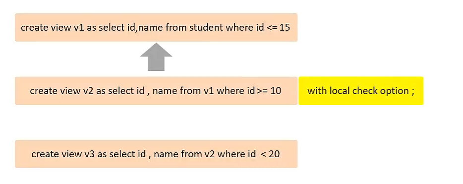

# 																																																MySQL 优化

## MySql 概述

​	数据库是 数据存储的仓库，数据有组织的进行存储   简称: DataBase（DB）

​	数据库管理系统： 操纵和管理数据库的大型软件  简称: DataBase Management System（DBMS）

​	比如: Mysql , Origin，SqlServer 都是数据库管理系统

​	通过SQL 进行操作数据库 

​	SQL ： 操作关系型数据库的编程语言，定义了一套操作关系型数据库的同意标准 Structured Query Language （SQL）

​	$\textcolor{red}{关系型数据库}$: 建立在关系模型的基础上，有多张相互链接的二维表组成的数据库

​	特点：

1. 使用表存储数据，格式统一，便于维护
2. 使用SQL 语言操作，标准统一，使用方便

   $\textcolor{red}{二维表}$：就是像Excel 表格

##  $\textcolor{red}{MySql数据模型}$


## $\textcolor{red}{SQL}$

### 	SQL通用语法:

1. 语句可以单行或者多行书写，以分号结尾
2. SQL语句可以使用空格/缩进来增强语句的可读性
3. MySQL数据库的SQL语句不区分大小写，关键字建议使用大写
4. 注释:
    - 单行注释：--注释内容 或者 #注释内容
    - 多行注释：/* 注释内容 */

### 	SQL分类：

1. DDL：Data Definition Language 数据定义语言，用来定义数据库对象（数据库，表，字段）
2. DML：Data Manipulation Language 数据操作语言,用来对数据库表中的数据进行增删改
3. DQL：Data Query Language 数据库查询语言，用来查询数据库表中的记录
4. DCL：Data Control Language 数据控制语言，用来创建数据库用户，控制数据库的访问权限

### 	DDL：

- 查询

    - 查询所有数据库

        ```sql
        SHOW DATABASES ;
        ```

    - 查询当前数据库

        ```sql
        SELECT DATABASE();
        ```

    - 创建

        ```sql
        CREATE DATABASE IF NOT EXISTS 数据库名称 DEFAULT CHAR SET 字符集 COLLATE 排序规则;
        字符集 utf8mb4 占用四个字节 默认是三个字节
        ```

    - 删除

        ```sql
        DROP DATABASE IF EXISTS 数据库名称;
        ```

    - 使用

        ```sql
        USE 数据库名称;
        ```

    - 查询当前数据库所有表

        ```sql
        SHOW TABLES;
        ```

    - 查询表结构

        ```sql
        DESC 表名称;
        ```

    - 查询指定表的创建语句

        ```sql
        SHOW CREATE TABLE 表名称;
        ```

    - 表操作-创建

        ```sql
        CREATE TABLE 表名称(
            字段 类型 COMMENT'字段注释'
        ) COMMENT '表注释';
        ```


### 		数值类型

| 分类     | 类型         | 大小    | 有符号（SIGNED）范围                                    | 无符号(UNSIGNED)范围                                       | 描述                 |
| :------- | :----------- | :------ | :------------------------------------------------------ | :--------------------------------------------------------- | :------------------- |
| 数值类型 | TINYINT      | 1 byte  | (-128,127)                                              | （0-255）                                                  | 小整数值             |
| 数值类型 | SMALLINT     | 2 byte  | (-32768,32767)                                          | （0-65535）                                                | 大整数值             |
| 数值类型 | MEDIUMINT    | 3 byte  | (-8388608,8388607)                                      | （0-16777215）                                             | 大整数值             |
| 数值类型 | INT或INTEGER | 4 byte  | (-2147483648,2147483647)                                | （0-4294967295）                                           | 大整数值             |
| 数值类型 | BIGINT       | 8 byte  | (-2^63, 2^63-1)                                         | （0-2^64-1）                                               | 极大整数值           |
| 数值类型 | FLOAT        | 4 byte  | (-3.402823466E+38,3.402823466351E+38)                   | 0 和 （1.75494351 E-38, 3.402823466 E+38）                 | 单精度浮点数值       |
| 数值类型 | DOUBLE       | 8  byte | (-1.7976931348623157E+308,1.7976931348623157E+308)jeitu | 0 和（2.2250738585072014 E-308, 1.7976931348623157 E+308） | 双精度浮点数值       |
| 数值类型 | DECIMAL      |         | 依赖于M（精度）和D（标度）的值                          | 依赖于M（精度）和D（标度）的值                             | 小数值（精确定点数） |

### 		字符串类型

| 分类       | 类型       | 大小               | 描述                         |
| ---------- | ---------- | ------------------ | ---------------------------- |
|            | CHAR       | 0-255 bytes        | 定长字符串 性能高            |     | VARCHAR    | 0-65535 bytes      | 变长字符串 性能差            |
|            | TINYBLOB   | 0-255 bytes        | 不超过255个字符的二进制数据  |
|            | TINYTEXT   | 0-255 bytes        | 短文本字符串                 |
|            | BLOB       | 0-65 535 bytes     | 二进制形式的长文本数据       |
| 字符串类型 | TEXT       | 0-65 535 bytes     | 长文本数据                   |
|            | MEDIUMBLOB | 0-16777215 bytes   | 二进制形式的中等长度文本数据 |
|            | MEDIUMTEXT | 0-16777215 bytes   | 中等长度文本数据             |
|            | LONGBLOB   | 0-4294967295 bytes | 二进制形式的极大文本数据     |
|            | LONGTEXT   | 0-4294967295 bytes | 极大文本数据                 |

### 		时间类型

​	

| 分类     | 类型      | 大小 | 范围                                       | 格式                 | 描述                     |
| -------- | --------- | ---- | ------------------------------------------ | -------------------- | ------------------------ |
|          | DATE      | 3    | 1000-01-01 至 9999-12-31                   | YYYY-MM-DD           | 日期值                   |
|          | TIME      | 3    | -838:59:59 至 838:59:59                    | HH:MM:SS             | 时间值或持续时间         |
| 日期类型 | YEAR      | 1    | 1901 至 2155                               | YYYY                 | 年份值                   |
|          | DATETIME  | 8    | 1000-01-01 00:00:00 至 9999-12-31 23:59:59 | YYYY-MM-DD  HH:MM:SS | 混合日期和时间值         |
|          | TIMESTAMP | 4    | 1970-01-01 00:00:01 至 2038-01-19 03:14:07 | YYYY-MM-DD  HH:MM:SS | 混合日期和时间值，时间戳 |

- 表操作-修改

    - 添加字段

        ```sql
        ALTER TABLE 表名 ADD 字段名称 类型(长度) COMMENT'注释' 约束;
        ```

    - 修改数据类型

        ```sql
        ALTER TABLE 表名 MODIFY 字段名 新数据类型(长度)
        ```

    - 修改字段名和字段类型

        ```sql
        ALTER TABLE 表名 CHANGE 旧表名 新表名 类型(长度) COMMENT '注释' 约束
        ```

    - 删除字段

        ```sql
        ALTER TABLE 表名 DROP 字段名 ;
        ```

    - 修改表名

        ```sql
        ALTER TABLE 表名 RENAME TO 新表名;
        ```

### DML：

- 添加单行数据

    ```sql
    INSERT INTO 表名 VALUES (字段1值，字段2值);
    
    INSERT INTO 表名(字段1,字段2) VALUES (字段1值，字段2值);
    ```

- 添加多行数据

    ```sql
    INSERT INTO 表名(字段1,字段2) VALUES (字段1值，字段2值),(字段1值，字段2值);
    ```

- 修改数据

    ```sql
     UPDATE 表名 SET 字段=修改值 WHERE 修改条件
    ```

- 删除数据

    ```sql
    DELETE FROM 表名 WHERE 修改条件
    ```

### DQL：

- 关键字 为 SELECT

    ```sql
    SELECT
        字段列表
    FROM
        表名
    WHERE
        条件列表
    GROUP BY
        分组列表
    HAVING
        分组后列表条件
    ORDER BY
        排序列表
    LIMIT
        分页列表
    ```

- 查询多个字段

    ```sql
    SELECT 字段1,字段2,字段3....FROM 表明;
    
    SELECT * FROM 表明;
    ```

- 设置别名

    ```sql
    SELECT 字段1[AS 别名1],字段2[AS 别名2]... FROM 表明;
    ```

- 去除重复记录

    ```sql
    SELECT DISTINCT 字段列表 FROM 表明;
    ```

#### **DQL-条件查询**

- 语法：

    ```sql
    SELECT 字段列表 FROM WHERE 条件列表;
    ```

- 条件

    | 比较运算符        | 功能                                   | 逻辑运算符 | 功能                     |
    | ----------------- | -------------------------------------- | ---------- | ------------------------ |
    | \>                | 大于                                   | AND 或 &&  | 并且（多个条件同事成立） |
    | \>=               | 大于等于                               | OR 或 \|\| | 或者（多个条件任意成立） |
    | <                 | 小于                                   | NOT 或  !  | 非，不是                 |
    | <=                | 小于等于                               |            |                          |
    | =                 | 等于                                   |            |                          |
    | <> 或 !=          | 不等于                                 |            |                          |
    | BETWEEN...AND.... | 在某个范围之内(含最小,最大值)          |            |                          |
    | IN(....)          | 在in之后的列表中的值，多选一           |            |                          |
    | LIKE 占位符       | 模糊匹配(_匹配单个字符，%匹配任意字符) |            |                          |
    | IS NULL           | 是NULL                                 |            |                          |

#### DQL-聚合函数

- 介绍

    - 将一列数据作为以一个整体，进行纵向计算

- 常见的聚合函数

    | 函数  | 功能     |
    | ----- | -------- |
    | count | 统计数量 |
    | max   | 最大值   |
    | min   | 最小值   |
    | avg   | 平均值   |
    | sum   | 求和     |

- 语法

    ```sql
    SELECT 聚合函数(字段列表) FROM 表名;
    
    注意: null值不参与所有聚合函数的运算
    ```

#### DQL-分组查询

- 语法

    ```sql
    SELECT 字段列表 FROM 表名 WHERE 条件 GROUP BY 分组字段名 HAVING 分组后的过滤条件;
    ```

- WHERE 和	HAVING 的区别

    - 执行时机不同：where 是分组之前进行过滤，不满足where的条件，不参与分组；而having是分组之后对结果进行过滤的
    - 判断条件不同：where不能对聚合函数进行判断，而having可以 
    - 注意
        - 执行顺序：where >聚合函数 >having
        - 分组之后：查询的字段一般为聚合函数和分组字段，查询其他字段无任何意义

#### DQL-排序查询

- 语法

    ```sql
    SELECT 字段列表 FROM 表名 ORDER BY 字段1 排序方式1，字段2 排序方式2;
    ```

- 排序方式

    - ASC：升序（默认）

    - DESC：降序

        $\textcolor{red}{注意：如果是多个字段排序，当第一个字段值相同时，才会根据第二个字段进行排序}$

#### DQL-分页查询

- 语法

    ```sql
    SELECT 字段列表 FROM 表名 LIMIT 起始索引,查询记录数;
    ```

- 注意

    - 起始索引从0开始，起始索引=（查询页码-1）*每页显示的记录数
    - 分页查询是数据库的方言，不同数据库有不同的实现，Mysql中是LIMIT
    - 如果查询的是第一页数据，起始索引可以省略，直接简写为LIMIT 10

#### DQL-执行顺序：


### DCL-介绍：

- DCL：Data Control Language 数据控制语言，用来创建数据库用户，控制数据库的访问权限

#### DCL-管理用户

- 查询用户

    ```sql
    USE mysql
    SELECT * FROM user;
    ```

- 创建用户

    ```sql
    CREATE USER '用户名'@'主机名' IDENTIFIED BY '密码';
    ```

- 修改用户密码

    ```sql
    ALTER USER '用户名'@'主机名' IDENTIFIED WITH mysql_native_password BY '新密码';
    ```

- 删除用户

    ```sql
    DROP USER '用户名'@'主机名';
    ```

- 注意

    - 主机名可以使用 % 通配
    - 这类SQL开发人员操作的比较少，主要是DBA（Database Administrator 数据管理员）使用

#### DCL-权限控制

- MySQL中定义了许多种权限，但常用的就是以下几种：

    | 权限               | 说明             |
    | :----------------- | :--------------- |
    | ALL,ALL PRIVILEGES | 所有权限         |
    | SELECT             | 查询数据         |
    | INSERT             | 播入数据         |
    | UPDATE             | 修改数据         |
    | DELETE             | 刪除数据         |
    | ALTER              | 修改表           |
    | DROP               | 除数据库/表/视图 |
    | CREATE             | 创建数据库/表    |

- 查询权限

    ```sql
    SHOW GRANTS FOR '用户名'@'主机';
    ```

- 授予权限

    ```sql
    GRANT 权限列表 ON 数据库名称.表名 TO '用户名'@‘'主机名';
    ```

- 撤销权限

    ```sql
    REVOKE 权限列表 ON 数据库名称.表名 FROM '用户名'@'主机名';
    ```

### 函数：

​	函数：是指一段可以直接被另一段程序调用的程序或代码。

1. 字符串函数
2. 数值函数
3. 日期函数
4. 流程函数

#### 字符串函数：

​	MySQL中内置了很多的字符串函数,常用的几个如下：

| 函数                     | 功能                                                      |
| ------------------------ | --------------------------------------------------------- |
| CONCAT(S1,S2,...Sn)      | 字符串拼接，将51,52，.Sn拼接成一个字符串                  |
| LOWER(str)               | 将字符串str全部转为小写                                   |
| UPPER(str)               | 将字符串str全部转为大写                                   |
| LPAD(str,n,pad)          | 左填充，用字符串pad对str的左边进行填充，达到n个字符串长度 |
| RPAD(str,n,pad)          | 右填充，用字符串pad对st的右边进行填充，达到n个字符串长度  |
| TRIM(str)                | 去掉字符串头部和尾部的空格                                |
| SUBSTRING(str,start,len) | 返回从字符串str从sart位置起的len个长度的字符串            |

​	语法

```sql
SELECT 函数(参数);
```

#### 数值函数：

​	常见的数值函数如下：

| 函数       | 函数                              |
| ---------- | --------------------------------- |
| CEIL(x)    | 向上取整                          |
| FLOOR(X)   | 向下取整                          |
| MOD(x,y)   | 返回x/y的模                       |
| RAND()     | 返回01内的随机数                  |
| ROUND(x,y) | 求参数的四舍五入的值，保留y位小数 |

#### 日期函数：

​	常见的日期函数如下：

| 函数                              | 功能                                             |
| --------------------------------- | ------------------------------------------------ |
| CURDATE()                         | 返回当前日期                                     |
| CURTIME()                         | 返回当前时间                                     |
| NOW()                             | 返回当前日期和时间                               |
| YEAR(date)                        | 获取指定date的年份                               |
| MONTH(date)                       | 获取指定date的月份                               |
| DAY(date)                         | 获取指定date的日期                               |
| DATE_ADD(date,INTERVAL expr type) | 返回一个日期/时间值加上一个时间间隔xpr后的时间值 |
| DAILDIFF(date1,dale2)             | 返回起始时间dle1和结束时间dale2之间的天数        |

#### 流程函数：

​	流程函数也是一类函数，可以在SQL语句中实现条件筛选，从而提高语句的效率

| 函数                                                  | 功能                                               |
| ----------------------------------------------------- | -------------------------------------------------- |
| IF(value,t,f)                                         | 如果alue为tue,则返回t,否则返回f                    |
| IFNULL(valuel value2)                                 | 如果value1不为空，返回value1,否则返回alue2         |
| CASE WHEN [val1 J THEN [res1]..ELSE default END       | 如果valT为true,返回es1,.否则返回detaut默认值       |
| CASE expr」WHEN [val1」THEN [res1]..ELSE default」END | 如果epr的值等于all,返回resl,.否则返回default默认值 |

### 约束

​	概述：约束是作用于表中字段上的规则，用于限制存储在表中的数据。

​	目的：保证数据库中数据的正确，有效性和完整性。

​	分类：

| 约束                    | 描述                                                     | 关键字      |
| ----------------------- | -------------------------------------------------------- | ----------- |
| 非空约束                | 限制该字段的数据不能为null                               | NOT NULL    |
| 唯一约束                | 保证该字段的所有数据鄂是唯一、不重复的                   | UNIQUE      |
| 主键约束                | 主键是一行数据的难一标识，要求非空且唯一                 | PRIMARY KEY |
| 默认约束                | 保存数据时，如果未指定该字段的值，则采用默认值           | DFFAULT     |
| 检查约束8.0.16版本之后) | 保证字段值满足某一个条件                                 | CHECK       |
| 外键约束                | 用来让两张表的数据之间建立连接，保证数据的一致性和完整性 | FORFIGN KFY |

$\textcolor{red}{注意：约束时作用与表中字段上的，可以在创建表/修改表的时候添加约束}$

语法：

```sql
CREATE TABLE 表名(
    字段 类型 约束 COMMENT'注释'
)COMMENT '注释';
```

#### 外键约束：

​	概念：外键用来让两张表的数据之间建立链接，从而保证数据的一致性和完整性


#### 语法：

##### 		添加外键

```sql
#创建表的时候
CREATE TABLE tb_user(
    字段名 数据类型,
    CONSTRAINT 外键名称 FOREIGN KEY (外键字段名) REFERENCES 主表(主表列名)
) COMMENT '注释';


修改表结构
ALTER TABLE 表名 ADD CONSTRAINT 外键名称 FOREIGN KEY (外键字段名) REFERENCES 主表(主表列名);
```

##### 		删除外键

```sql
ALTER TABLE 表名 DROP FOREIGN KEY 外键名称;
```

##### 		删除/更新行为

| 行为        | 说明                                                         |
| ----------- | ------------------------------------------------------------ |
| NO ACTION   | 当在父表中删除/更新对应记录时，首先检查该记录是否有对应外键，如果有则不允许删除/更新。（与RESTRICT一致） |
| RESTRICT    | 当在父表中删除/更新对应记录时，首先检查该记录是否有对应外键，如果有则不允许删除/更新。（与NO ACTION一致） |
| CASCADE     | 当在父表中删除/更新对应记录时，首先检查该记录是否有对应外键，如果有，则也删除更新外键在子表中的记录。 |
| SET NULL    | 当在父表中删除对应记录时，首先检查该记录是否有对应外键，如果有则设置子表中该外键值为null(这就要求该外键允许取ull) |
| SET DEFAULT | 父表有变更时，子表将外键列设置成一个默认的值(Innodb不支持)   |

```sql
ALTER TABLE 表名 ADD CONSTRAINT 外键名称 FOREIGN KEY (外键字段名) REFERENCES 主表(主表列名) ON UPDATE CASCADE ON DELETE CASCADE;


# SET NULL 的约束
ALTER TABLE 表名 ADD CONSTRAINT 外键名称 FOREIGN KEY (外键字段名) REFERENCES 主表(主表列名) ON UPDATE SET NULL ON DELETE SET NULL ;
```

### 多表查询

#### 	多表关系

​		概述：

项目开发中，在进行数据库表结构设计时，会根据业务需求及业务模块之间的关系，分析并设计表结构，由于业务之间相互关联，所以各个表结构之间也存在着各种联系，基本上分为三种：

1. 一对多（多对一）

    1. 案例：部门与员工的关系
    2. 关系：一个部门对应多个员工，一个员工对应一个部门
    3. 实现：在多的一方建立外键，指向一的一方的主键

    

2. 多对多

    1. 案例：学生与课程的关系

    2. 关系：一个学生可以选修多门课程，一门课程也可以提供多个学生选择

    3. 实现：建立第三张中间表，中间表至少包含两个外键，分别关联两方的主键

        

3. 一对一

    1. 案例：用户与用户详情的关系

    2. 关系：一对一关系，多用于单表拆分，将一张表的基础字段放在一张表中，其他详情字段放在另一张表中，以提升操作效率

    3. 实现：在任意一方加入外键，关联另一方的主键，并且设置外键为唯一的（UNIQUE）

        

#### 多表查询

​	概述：指从多张表中查询数据

​	笛卡尔积：笛卡尔积是指在数学中，两个集合A集合和B集合的所有组合情况（在多表查询时，需要消除无效的笛卡尔积）


#### 多表查询分类

1. 连接查询

    1. 内连接：相当于查询A，B交集部分数据
    2. 外连接
        1. 左外连接：查询左表所有数据，以及两张表交集部分数据
        2. 右外连接：查询右表所有数据，以及两张表交集部分数据
    3. 自连接：当前表与自身的连接查询，自连接不许使用表别名

2. 子查询

    1. 连接查询-内连接

        1. 内连接查询语法

            1. 隐式查询

                ```sql
                SELECT 字段列表 FROM 表1,表2 WHERE 连接条件（表的主外键）;
                ```

            2. 显示查询

                ```sql
                SELECT 字段列表 FROM 表1 别名 INNER JOIN 表2 别名 ON 连接条件（表的主外键）;
                
                可以省略 INNER
                ```

        2. $\textcolor{red}{内连接查询的是两张表交集的部分}$

            

    2. 连接查询-外连接

        1. 连接查询语法

            1. 左外连接

                ```sql
                SELECT 字段列表 FROM 表1 别名 LEFT JOIN 表2 别名 ON 连接条件（表的主外键）;
                
                SELECT 字段列表 FROM 表1 别名 LEFT OUTER JOIN 表2 别名 ON 连接条件（表的主外键）;
                可以省略 OUTER
                ```

                $\textcolor{red}{相当于查询表1（左表）的所有数据 包含 表1和表2交集的部分的数据}$

            2. 右连接

                ```sql
                SELECT 字段列表 FROM 表1 别名 RIGHT JOIN 表2 别名 ON 连接条件（表的主外键）;
                
                SELECT 字段列表 FROM 表1 别名 RIGHT OUTER JOIN 表2 别名 ON 连接条件（表的主外键）;
                可以省略 OUTER
                ```

                $\textcolor{red}{相当于查询表2（右表）的所有数据 包含 表1和表2交集的部分的数据}$

    3. 连接查询-自连接

        1. 自连接查询语法：

            ```sql
            SELECT 字段列表 FROM 表A 别名 JOIN 表A 别名 ON 连接条件;
            SELECT 字段列表 FROM 表A 别名 , 表A 别名 WHERE 连接条件;
            
            -- 外连接
            SELECT 字段列表 FROM 表A 别名 LEFT JOIN 表A 别名 ON 连接条件;
            SELECT 字段列表 FROM 表A 别名 RIGHT JOIN 表A 别名 ON 连接条件;
            ```

            $\textcolor{red}{自连接查询，可以是内连接查询，也可以是外连接查询}$

    4. 联合查询-union，union all

        1. 概述：对于union查询，就是把多次查询的结果合并起来，形成一个新的查询结果集。

        2. 语法

            ```sql
            SELECT 字段列表 FROM 表A
            UNION
            SELECT 字段列表 FROM 表B;
            -- 给查询的结果合并之后去重
            -- 或者
            SELECT 字段列表 FROM 表A
            UNION ALL
            SELECT 字段列表 FROM 表B;
            --直接查询全部结果
            ```

            $\textcolor{red}{对于联合查询的多张表的列数必须保持一直，字段类型也需要保持一致}$

            $\textcolor{red}{UNION ALL 会将全部的数据直接合并在一起，UNION会对合并之后的数据去重}$

3. 子查询

    1. 概述：SQL语句中嵌套SELECT语句，称为嵌套查询，又称子查询

        ```sql
        SELECT * FROM 表1 WHERE 列名 = (SELECT 列名 FROM 表2)
        ```

        $\textcolor{red}{子查询外部的语句可以是INSERT / UPDATE / DELECT / SELECT 的任何一个}$

    2. 根据子查询的结果不同，分为：

        - 标量子查询（子查询结果值为单个值）
        - 列子查询（子查询的结果为一列）
        - 行子查询（子查询的结果为一行）
        - 表子查询（子查询的结果为多列）

    3. 根据子查询位置，分为：WHERE之后，FROM之后，SELECT之后

    4. 子查询

        1. 标量子查询

            1. 概述：子查询返回的结果是单个值（数字，字符串，日期等），最简单的形式，这种子查询称为标量子查询

            2. 常用的操作符：=  	<>		>	>=	<		<=

            3. 语法：

                ```sql
                SELECT * FROM 表1 WHERE 列名 = (SELECT 列名 FROM 表2 WHERE 条件);
                SELECT * FROM 表1 WHERE 列名 <> (SELECT 列名 FROM 表2 WHERE 条件);
                SELECT * FROM 表1 WHERE 列名 > (SELECT 列名 FROM 表2 WHERE 条件);
                SELECT * FROM 表1 WHERE 列名 >= (SELECT 列名 FROM 表2 WHERE 条件);
                SELECT * FROM 表1 WHERE 列名 < (SELECT 列名 FROM 表2 WHERE 条件);
                SELECT * FROM 表1 WHERE 列名 <= (SELECT 列名 FROM 表2 WHERE 条件);
                ```

        2. 列子查询

            1. 概述：子查询返回的结果是一列（可以是多行），这种子查询称为列子查询

            2. 常用的操作符：IN		NOT IN		ANY			SOME		ALL	

                | 操作符 | 描述                                   |
                | ------ | -------------------------------------- |
                | IN     | 在指定的集合范围之内，多选一           |
                | NOT IN | 不在指定的集合范围之内                 |
                | ANY    | 子查询返回列表中，有任意一个满足即可   |
                | SOME   | 与ANY等同，使用SOME的地方都可以使用ANY |
                | ALL    | 子查询返回列表的所有值都必须满足       |

            3. 语法：

                ```sql
                SELECT * FROM 表1 WHERE 列名 IN (SELECT 列名 FROM 表2 WHERE 条件1);
                
                SELECT * FROM 表1 WHERE 列名 > ALL (SELECT 列名 FROM 表2 WHERE 条件1);
                
                SELECT * FROM 表1 WHERE 列名 > ANY (SELECT 列名 FROM 表2 WHERE 条件1);
                
                SELECT * FROM 表1 WHERE 列名 > SOME (SELECT 列名 FROM 表2 WHERE 条件1);
                ```

        3. 行子查询：

            1. 概述：子查询的返回结果返回的结果是一行（可以是多列），这种子查询称为行字查询

            2. 常用的操作符：=	<>	IN	NOT	IN

                ```sql
                SELECT 列名 FROM 表名 WHERE (条件1,条件2) = (SELECT 条件1列名,条件2列名 FROM 表名 WHERE 删选条件)
                ```

        4. 表字查询：

            1. 概述：子查询返回的结果是多行多列，这种子查询称为表子查询

            2. 常用的操作符：IN

                ```
                SELECT 列名 FROM 表名 WHERE(条件1,条件2) IN (SELECT 条件1列名,条件2列名 FROM 表名 WHERE 筛选条件)
                
                SELECT 列名 FROM (SELECT 列名 FROM 表名 WHERE 筛选条件) 别名 LEFT JOIN 连接条件
                ```

### 事务：

​	事务是一组操作的集合，他是一个不可分割的工作单位，事务会把所有的操作作为一个整体一起向系统提交或撤销操作请求，即这些操作要么同时成功，要么同时失败


​	默认MySQL的事务是自动提交的，也就是说，当执行一条DML语句，MySQL会立即隐式提交事务

#### 	事务操作：

1. 查看/设置事务提交方式

    ```sql
    SELECT @@autocommit;
    
    SET @@autocommit=0;
    ```

2. 提交事务

    ```sql
    COMMIT;
    ```

3. 回滚事务

    ```sql
    ROLLBACK;
    ```

4. 开启事务

    ```sql
    SELECT TSTART TRANSACTION 或者 BEGIN
    ```

#### 事务的四大特性：

​	原子性(Atomicity)：事务是不可分割的最小操作单元，要么全部成功，要么全部失败。

​	一致性(Consistency)：事务完成时，必须使所有的数据都保持一致状态。

​	隔离性(Isolation)：数据库系统提供的隔离机制，保证事务在不受外部并发操作影响的独立环境下运行。

​	持久性(Durability)：事务一旦提交或回滚，它对数据库中的数据的改变就是永久的。

#### 并发事务问题：

| 问题       | 描述                                                         |
| ---------- | ------------------------------------------------------------ |
| 脏读       | 一个事务读到另外一个事务还没有提交的数据。                   |
| 不可重复读 | 一个事务先后读取同一条记录，但两次读取的数据不同，称之为不可重复读。 |
| 幻读       | 一个事务按照条件查询数据时，没有对应的数据行，但是在插入数据时，又发现这行数据已经存在，好像出现了幻影”。 |


#### 	事务的隔离级别：

| 隔离级别                               | 脏读 | 不可重复读 | 幻读 |
| -------------------------------------- | ---- | ---------- | ---- |
| Read uncommitted（性能高，数据不安全） | √    | √          | √    |
| Read committed                         | ×    | √          | √    |
| Repeatable Read(默认)                  | ×    | ×          | √    |
| Serializable（性能差，数据安全）       | ×    | ×          | ×    |

​	查看事务隔离级别

```sql
SELECT @@TRANSACTION_ISOLATION;
```

​	设置事务隔离级别

```sql
SET [SESSION | GLOBAL] TRANSACTION ISOLATION LEVEL {READ UNCOMMITTED | READ COMMITTED | REPEATABLE READ | SERIALIZABLE}
```

$\textcolor{red}{注意：事务的隔离级别越高，数据越安全，但是性能越低。}$

## MySQL存储引擎

### 	MySQL体系结构：


1. **连接层**

    最上层是一些客户端和链接服务，主要完成一些类似于连接处理、授权认证、及相关的安全方案。服务器也会为安全接入的每个客户端验证它所具有的操作权限。

2. **服务层**

    第二层架构主要完成大多数的核心服务功能，如SQL接口，并完成缓存的查询，SQL的分析和优化，部分内置函数的执行。所有跨存储引擎的功能也在这一层实现，如过程、函数等。

3. **引擎层**

    存储引擎真正的负责了MySQL中数据的存储和提取，服务器通过API和存储引擎进行通信。不同的存储引擎具有不同的功能，这样我们可以根据自己的需要，来选取合适的存储引擎。

4. **存储层**

    主要是将数据存储在文件系统之上，并完成与存储引擎的交互。

### 存储引擎简介：

​	存储引擎就是存储数据、建立索引、更新/查询数据等技术的实现方式。存储引擎是基于表的，而不是基于库的，所以存储引擎也可被称为表类型。

​	在创建表的时候，指定存储引擎

```sql
CREATE TABLE 表名(
    字段 类型 COMMENT '注释',
    字段 类型 COMMENT '注释'
) ENGINE = 存储引擎 COMMENT '注释';
```

​	查看当前数据开支持的存储引擎

```sql
OW ENGINES;
```

### 存储引擎特点：

​	介绍：

​		INNODB是一中兼顾高可靠性和高性能的通用存储引擎，在MySQL5.5之后，INNODB是默认的MySQL存储引擎。

​	特点：

​		DML操作遵循ACID模型，支持$\textcolor{rgb(255, 153, 1)}{事务}$

​		$\textcolor{rgb(255, 153, 1)}{行级锁}$，提高并发访问性能

​		支持$\textcolor{rgb(255, 153, 1)}{外键}$FOREIGN KEY约束，保证数据的完整性和正确性

​	文件：

​		xxx.ibd：xxx代表的是表名，innoDB引擎的每张表都会有这样一个空间文件，存储该表的表结构（frm，sdi），数据引擎。

​		参数：innodb_file_per_table

```sql
# 查看表文件
SHOW VARIABLES LIKE 'innodb_file_per_table';

# 查看ibd文件内容
ibd2sdi xxx.ibd
```

#### InnoDB 逻辑结构图：


#### MyISAM：

介绍：

​	MyISAM是MySQL早期的默认引擎

特点：

​	不支持事务，不支持外键

​	支持表锁，不支持行锁

​	访问速度快

包括文件：


xxx.sdi表结构 	

xxx.MYD表数据	

xxx.MYI索引

#### Memory：

介绍：

​	Memoryi引擎的表数据是存储在内存中的，由于受到硬件问题、或断电问题的影响，只能将这些表作为临时表或缓存使用。

特点：

​	内存存放

​	hash索引（默认）

文件：

​	xxx.sdi：存储表结构信息

#### 存储引擎特点：

| 特点         | InnoDB            | MyISAM | Memory |
| ------------ | ----------------- | ------ | ------ |
| 存储限制     | 64TB              | 有     | 有     |
| 事务安全     | 支持              | \----  | \----  |
| 锁机制       | 行锁              | 表锁   | 表锁   |
| B+tree索引   | 支持              | 支持   | 支持   |
| Hash索引     | \----             | \----  | 支持   |
| 全文索引     | 支持(5.6版本之后) | 支持   | \----  |
| 空间使用     | 高                | 低     | N/A    |
| 内存使用     | 高                | 低     | 中等   |
| 批量插入速度 | 低                | 高     | 高     |
| 支持外键     | 支持              | \----  | \----  |

#### 存储引擎选择

在选择存储引擎时，应该根据应用系统的特点选择合适的存储引擎。对于复杂的应用系统，还可以根据实际情况选择多种存储引擎进行组合。

-   InnoDB：是Mysq的默认存储引擎，支持事务、外键。如果应用对事务的完整性有比较高的要求，在并发条件下要求数据的一致性，数据操作除了插入和查询之外，还包含很多的更新、删除操作，那么InnoDB存储引擎是比较合适的选择。
-   MyISAM：如果应用是以读操作和插入操作为主，只有很少的更新和删除操作，并且对事务的完整性、并发性要求不是很高，那么选择这个存储引擎是非常合适的。
-   MEMORY：将所有数据保存在内存中，访问速度快，通常用于临时表及缓存。MEMORY的缺陷就是对表的大小有限制，太大的表无法缓存在内存中，而且无法保障数据的安全性。

## 索引：

### 	概述：

​	索引（index)是帮助MySQL高效获取数据的数据结构（有序）。在数据之外，数据库系统还维护着满足特定查找算法的数据结构，这些数据结构以某种方式引用（指向）数据，这样就可以在这些数据结构上实现高级查找算法，这种数据结构就是索引。


### 优缺点：

| 优势                                                         | 劣势                                                         |
| ------------------------------------------------------------ | ------------------------------------------------------------ |
| 提高数据检索的效率，降低数据库的O成本                        | 索引列也是要占用空间的。                                     |
| 通过索引列对数据进行排序，降低数据排序的成本，降低CPU的消耗。 | 索引大大提高了查询效率，同时却也降低更新表的速度，如对表进行INSERT、UPDATE、DELETE时，效率降低。 |

### 索引结构：

MySQL的索引是在存储引擎层实现的，不同的存储引擎有不同的结构，主要包含以下几种：

| 索引结构              | 描述                                                         |
| --------------------- | ------------------------------------------------------------ |
| B+Tree索引            | 最常见的索引类型，大部分引擎都支持B+树索引                   |
| Hash索引              | 底层数据结构是用哈希表实现的，只有精确匹配索引列的查询才有效不支持范围查询 |
| R-Tree(空间索引)      | 空间索引是MyISAM引擎的一个特殊索引类型，主要用于地理空间数据类型，通常使用较少 |
| Full-text（全文索引） | 是一种通过建立倒排索引，快速匹配文档的方式。类似于Lucene,Solr,ES |

#### 索引结构：

| 索引                  | InnoDB          | MyISAM | Memory |
| --------------------- | --------------- | ------ | ------ |
| B+Tree索引            | 支持            | 支持   | 支持   |
| Hash索引              | 不支持          | 不支持 | 支持   |
| R-Tree(空间索引)      | 不支持          | 支持   | 不支持 |
| Full-text（全文索引） | 5.6版本之后支持 | 支持   | 不支持 |

$\textcolor{red}{我们平常所说的索引，如果没有特别指明，都是B+Tree结构组织的索引}$

#### 索引结构图以及演示：

二叉树：


$\textcolor{red}{二叉树缺点：顺序插入时，会形成一个链表，查询性能大大降低。大数据量情况下，层级较深，检索速度慢。}$

$\textcolor{red}{红黑树：大数据量情况下，层级较深，检索速度慢。}$

B-Tree（多路平衡查找树）：

​	以一颗最大度数（max-degree）为5（5阶）的B-Tree为例（每个节点最多存储4个Key，5个指针）

​	$\textcolor{red}{树的度数指的是一个节点的子节点个数}$


演示：

插入数据

```
插入100 65 169 368 900 556 780 35 215 1200 234 888 158 90 1000 88 120 268 250数据为例。
```

网址：https://www.cs.usfca.edu/~galles/visualization/Algorithms.html

形成裂变：中间元素向上裂变


B+Tree：

以一颗最大度数（max-degree）为4（4阶）的B+Tree为例


$\textcolor{red}{特点：}$

​	$\textcolor{red}{非叶子节点的元素起到索引的作用}$

​	$\textcolor{red}{所有的元素都会出现在叶子节点}$

​	$\textcolor{red}{叶子节点形成单项列表}$

演示：

​	添加数据

```
插入100 65 169 368 900 556 780 35 215 1200 234 888 158 90 1000 88 120 268 250数据为例。
```


### 索引结构：

#### 	MySQL中B+Tree

MySQL索引数据结构对经典的B+Tree进行了优化。在原B+Tree的基础上，增加了一个指向相邻叶子节点的链表指针，就形成了带有顺序指针的B+Tree，提高区间访问性能。


#### 	Hash：

哈希索引就是采用一定的Hash算法，将键值换算成新的Hash值，映射到对应的槽位上，然后存储在hash表中

如果两个（或多个）键值，映射到相同的槽位上，他们就产生了Hash冲突（也成为Hash碰撞），可以通过链表来解决


##### Hash索引特点：

1.  Hash索引只能用于对等比较（=，in），不支持范围查询（between，>，<，....）（因为Hash值存储的时候是没有顺序的）
2.  无法利用索引完成排序操作（因为Hash值存储的时候是没有顺序的）
3.  查询效率高，通常只通过一次检索就可以了，效率通常高于B+Tree索引（没有Hash值碰撞，会到链表中进行查找）

##### 存储引擎支持：

在MySQL中，支持Hash索引的是Memory引擎，而InnoDB中具有自适应hash功能（MySQL根据查询条件在指定的条件下会自动的将B+Tree索引构建成Hash索引），hash索引是存储引擎根据B+Tree索引指定条件下自动构建的。

##### 问什么innoDB存储引擎选择使用B+Tree？

-   相对于二叉树，层级更少，搜索效率高
-   相对于B-Tree，无论是叶子节点还是非叶子节点，都会保存数据，这样导致一页中存储的键值减少，指针跟着减少，要同样保存大量的数据，只能增加树的高度，导致性能降低
-   相对于Hash索引，B+Tree支持范围匹配及排序操作

### 索引的分类

| 分类     | 含义                                                 | 特点                     | 关键字   |
| -------- | ---------------------------------------------------- | ------------------------ | -------- |
| 主键索引 | 针对于表中主键创建的索引                             | 默认自动创建，只能有一个 | PRIMARY  |
| 唯一索引 | 避免同一个表中某数据列中的值重复                     | 可以有多个               | UNIQUE   |
| 常规索引 | 快速定位特定的数据                                   | 可以有多个               |          |
| 全文索引 | 全文索引查找的是文本中的关键词，而不是比较索引中的值 | 可以有多个               | FULLTEXT |

#### 在InnoDB存储引擎中，根据索引的存储形式，又可以分为以下两种：

| 分类                                                | 含义                                                       | 特点                 |
| --------------------------------------------------- | ---------------------------------------------------------- | -------------------- |
| 聚集索引（Clustered index）                         | 将数据存储与索引放到了一块，索引结构的叶子节点保存了行数据 | 必须有，而且只有一个 |
| 二级索引（Secondary index）（辅助索引，非聚集索引） | 将数据与索引分开存储，索引结构的叶子节点关联的是对应的主键 | 可以存在多个         |

#### 聚集索引的选取规则：

-   如果存在主键，主键索引就是聚集索引
-   如果不存在主键，将使用第一个唯一（UNIQUE）索引作为聚集索引
-   如果表中没有主键，或没有合适的唯一索引，则InnoDB会自动生成一个rowid作为隐藏的聚集索引


#### 以下那条SQL 执行效率高：

```sql
SELECT * FROM user WHERE id ='10'

SELECT * FROM user WHERE name='Arm'

备注：id为主键，name字段创建的有索引
```

#### 思考：InnoDB主键索引的B+Tree高度为多高？

提出假设：

​	一行数据大小为1k，一页中可以存储16行这样的数据。InnoDB的指针占用6个字节空间，（key）主键即使为bigint，占用8个字节。

高度为2

 n * 8+（n+1）* 6 = 16（k）* 1024（byte）算出n约为1170

### 索引语法：

-   创建索引

    ```sql
    CREATE [UNIQUE | FULLTEXT] INDEX index_name ON table_name (index_col_name,...);
    
    # ... 
    代表一个索引可以关联多个字段（称为：联合索引，组合索引）
    一个索引只关联一个字段（称为：单列索引）
    
    # index_name 规则  idx为（index 缩写）
    idx_表名_字段名
    ```

-   查看索引

    ```sql
    SHOW INDEX FROM table_name;
    
    SHOW INDEXES FROM table_name;
    
    SHOW KEYS FROM table_name;
    ```

-   删除索引

    ```sql
    DROP INDEX index_name ON table_name;
    ```

### SQL性能分析

#### 	SQL执行频率

​	MySQL客户端连接成功后，通过 SHOW [ SESSION | GLOBAL] STATUS 命令可以提供服务器状态信息，通过指令，可以查看当前数据库的INSERT，UPDATE，DELETE，SELECT 的访问频率；

```sql
# SESSION 当前会话  GLOBAL 全局状态
SHOW GLOBAL STATUS LIKE 'Com%';
#或者
SHOW GLOBAL STATUS LIKE 'Com_______';
```

#### 	慢查询日志：

慢查询日志记录了所有执行时间超过指定参数（Long_query_time，单位：秒，默认10秒）的所有SQL语句日志。

MySQL的慢查询日志默认没有开启，需要在MySQL的配置文件（/eetc/my.cnf）中配置如下信息：

```sql
#查看慢日志开启情况
SHOW VARIABLES LIKE 'slow_query_log';

#开启MySQL慢日志查询开关
slow_query_log=1
#设置慢日志的时间为2秒，SQL语句执行时间查过2秒，就会视为慢查询，记录慢查询日志
log_query_time=2
```

配置完毕之后，通过以下指令重启MySQL服务进行测试，查看慢日志文件中记录的信息/var/lib/mysql/localhost-slow.log

#### 	PROFILE详情：

SHOW PROFILES 能够在做SQL优化时帮助我们了解事件都耗在那里去了。通过HAVE_PROFILING参数，能够看到当前MySQL是否支持

PROFILE操作：

```sql
SELECT @@HAVE_PROFILING;
```

默认PROFILING是关闭的，可以通过set语句在SESSION / GLOBAL 级别开启PROFILING：

```sql
#查看开启状态 0 关闭  1 开启
SELECT @@PROFILING;

#开启开关
SET PROFILING = 1;

#查看每一条SQL的耗时基本情况
SHOW PROFILES;
#查看指定query_id的SQL语句哥哥极端的好事状况
SHOW PROFILE FOR QUERY query_id;
#查看指定query_id的SQL语句CPU的使用情况
SHOW PROFILE CPU FOR QUERY query_id;
```

#### 	EXPLAIN执行计划：

EXPLAN 或者 DESC 命令获取MySQL如何执行 SELECT 语句的信息，包括在SELECT语句执行过程中表如何连接和连接顺序。

语法：

```sql
#直接在 SELECT 语句之前加上关键字 EXPLAIN / DESC
EXPLAIN SELECT 字段列表 FROM 表名 WHERE 条件;
DESC SELECT 字段列表 FROM 表名 WHERE 条件;
```

查询出来的所有列


##### 	EXPLAIN执行计划的个字段含义：

1.  id
    1.  SELECT查询的序列号，表示查询中执行select子句或者是操作表的顺序(d相同，执行顺序从上到下；id不同，值逗大，题先执行)。
2.  select_type
    1.  SIMPLE：表示不需要[union](https://so.csdn.net/so/search?q=union&spm=1001.2101.3001.7020)操作或者不包含子查询的简单select查询。有连接查询时，外层的查询为simple，且只有一个
    2.  PRIMARY：一个需要union操作或者含有[子查询](https://so.csdn.net/so/search?q=子查询&spm=1001.2101.3001.7020)的select，位于最外层的单位查询的select_type即为primary。且只有一个
    3.  UNION：union连接的两个select查询，第一个查询是dervied派生表，除了第一个表外，第二个以后的表select_type都是union
    4.  DEPENDENT UNION：与union一样，出现在union 或union all语句中，但是这个查询要受到外部查询的影响
    5.  UNION RESULT：包含union的结果集，在union和union all语句中,因为它不需要参与查询，所以id字段为null
    6.  SUBQUERY：除了from字句中包含的子查询外，其他地方出现的子查询都可能是subquery
    7.  DEPENDENT SUBQUERY：与dependent union类似，表示这个subquery的查询要受到外部表查询的影响
    8.  DERIVED：from字句中出现的子查询，也叫做派生表，其他数据库中可能叫做内联视图或嵌套select
3.  table
    1.  显示的查询表名，如果查询使用了别名，那么这里显示的是别名，如果不涉及对数据表的操作，那么这显示为null，如果显示为尖括号括起来的就表示这个是临时表，后边的N就是执行计划中的id，表示结果来自于这个查询产生。如果是尖括号括起来的，与类似，也是一个临时表，表示这个结果来自于union查询的id为M,N的结果集。
4.  $\textcolor{red}{type}$
    1.  依次从好到差：null，system，const，eq_ref，ref，fulltext，ref_or_null，unique_subquery，index_subquery，range，index_merge，index，all，除了all之外，其他的type都可以使用到索引，除了index_merge之外，其他的type只可以用到一个索引
        1.  NULL：不查询表的时候出现
        2.  SYSTEM：表中只有一行数据或者是空表，且只能用于myisam和memory表。如果是Innodb引擎表，type列在这个情况通常都是all或者index
        3.  CONST：使用唯一索引或者主键，返回记录一定是1行记录的等值where条件时，通常type是const。其他数据库也叫做唯一索引扫描
        4.  EQ_REF：出现在要连接过个表的查询计划中，驱动表只返回一行数据，且这行数据是第二个表的主键或者唯一索引，且必须为not null，唯一索引和主键是多列时，只有所有的列都用作比较时才会出现eq_ref
        5.  REF：不像eq_ref那样要求连接顺序，也没有主键和唯一索引的要求，只要使用相等条件检索时就可能出现，常见与辅助索引的等值查找。或者多列主键、唯一索引中，使用第一个列之外的列作为等值查找也会出现，总之，返回数据不唯一的等值查找就可能出现。
        6.  FULLTEXT：全文索引检索，要注意，全文索引的优先级很高，若全文索引和普通索引同时存在时，mysql不管代价，优先选择使用全文索引
        7.  REF_OR_NULL：与ref方法类似，只是增加了null值的比较。实际用的不多。
        8.  UNIQUE_SUBQUERY：用于where中的in形式子查询，子查询返回不重复值唯一值
        9.  INDEX_SUBQUERY：用于in形式子查询使用到了辅助索引或者in常数列表，子查询可能返回重复值，可以使用索引将子查询去重。
        10.  索引范围扫描，常见于使用>
        11.  INDEX_MERGE：表示查询使用了两个以上的索引，最后取交集或者并集，常见and ，or的条件使用了不同的索引，官方排序这个在ref_or_null之后，但是实际上由于要读取所个索引，性能可能大部分时间都不如range
        12.  INDEX：索引全表扫描，把索引从头到尾扫一遍，常见于使用索引列就可以处理不需要读取数据文件的查询、可以使用索引排序或者分组的查询
        13.  ALL：这个就是全表扫描数据文件，然后再在server层进行过滤返回符合要求的记录。
5.  possible_keys
    1.  查询可能使用到的索引都会在这里列出来
6.  $\textcolor{red}{key}$
    1.  查询真正使用到的索引，select_type为index_merge时，这里可能出现两个以上的索引，其他的select_type这里只会出现一个
7.  key_len
    1.  用于处理查询的索引长度，如果是单列索引，那就整个索引长度算进去，如果是多列索引，那么查询不一定都能使用到所有的列，具体使用到了多少个列的索引，这里就会计算进去，没有使用到的列，这里不会计算进去。留意下这个列的值，算一下你的多列索引总长度就知道有没有使用到所有的列了。要注意，mysql的ICP特性使用到的索引不会计入其中。另外，key_len只计算where条件用到的索引长度，而排序和分组就算用到了索引，也不会计算到key_len中。
8.  ref
    1.  如果是使用的常数等值查询，这里会显示const，如果是连接查询，被驱动表的执行计划这里会显示驱动表的关联字段，如果是条件使用了表达式或者函数，或者条件列发生了内部隐式转换，这里可能显示为func
9.  rows
    1.  这里是执行计划中估算的扫描行数，不是精确值
10.  $\textcolor{red}{extra}$
     1.  DISTINCT：在select部分使用了distinc关键字
     2.  NO TABLES USED：不带from字句的查询或者From dual查询
     3.  使用not in()形式子查询或not exists运算符的连接查询，这种叫做反连接。即，一般连接查询是先查询内表，再查询外表，反连接就是先查询外表，再查询内表。
     4.  USING FILESORT：排序时无法使用到索引时，就会出现这个。常见于order by和group by语句中
     5.  USING INDEX：查询时不需要回表查询，直接通过索引就可以获取查询的数据。
     6.  USING JOIN BUFFER(block nested loop)，USING JOIN BUFFER(batched key accss)：5.6.x之后的版本优化关联查询的BNL，BKA特性。主要是减少内表的循环数量以及比较顺序地扫描查询。
     7.  using sort_union，using_union，using intersect，using sort_intersection：
         1.  USING INTERSECT：表示使用and的各个索引的条件时，该信息表示是从处理结果获取交集
         2.  USING UNION：表示使用or连接各个使用索引的条件时，该信息表示从处理结果获取并集
         3.  USING SORT_UNION和USING SORT_INTERSECTION：与前面两个对应的类似，只是他们是出现在用and和or查询信息量大时，先查询主键，然后进行排序合并后，才能读取记录并返回。
     8.  USING TEMPORARY：表示使用了临时表存储中间结果。临时表可以是内存临时表和磁盘临时表，执行计划中看不出来，需要查看status变量，used_tmp_table，used_tmp_disk_table才能看出来。
     9.  USING WHERE：表示存储引擎返回的记录并不是所有的都满足查询条件，需要在server层进行过滤。查询条件中分为限制条件和检查条件，5.6之前，存储引擎只能根据限制条件扫描数据并返回，然后server层根据检查条件进行过滤再返回真正符合查询的数据。5.6.x之后支持ICP特性，可以把检查条件也下推到存储引擎层，不符合检查条件和限制条件的数据，直接不读取，这样就大大减少了存储引擎扫描的记录数量。extra列显示using index condition
     10.  FIRSTMATCH(tb_name)：5.6.x开始引入的优化子查询的新特性之一，常见于where字句含有in()类型的子查询。如果内表的数据量比较大，就可能出现这个
     11.  LOOSESCAN(m..n)：5.6.x之后引入的优化子查询的新特性之一，在in()类型的子查询中，子查询返回的可能有重复记录时，就可能出现这个
     12.  除了这些之外，还有很多查询数据字典库，执行计划过程中就发现不可能存在结果的一些提示信息
11.  filtered
     1.  使用explain extended时会出现这个列，5.7之后的版本默认就有这个字段，不需要使用explain extended了。这个字段表示存储引擎返回的数据在server层过滤后，剩下多少满足查询的记录数量的比例，注意是百分比，不是具体记录数。

### 索引的使用：

验证索引的效率

​	在大数据的表中进行查询 ，查看执行效率，然后在表中建立索引进行查询，查看sql执行的时间

-   最左前缀法则

    -   如果索引了多列（联合索引），要遵守最左前缀法则。最左前缀法则指的是查询从索引的最左列开始，并且不跳过索引中的列如果跳跃某一列，$\textcolor{red}{索引将部分失效（后面的字段索引失效）}$

-   范围查询

    -   联合索引中，出现范围查询（>,<），范围查询右侧列索引失效
    -   在业务的允许下进行使用 >= 或者 <= 可以规避范围查询索引失效

-   索引列运算

-   -   不要在索引列上进行运算操作，$\textcolor{red}{索引将失效}$

-   字符串不加引号

    -   字符串类型字段使用时，不加引号，索引将会失效。

-   模糊查询

    -   如果仅仅是尾部模糊匹配，索引不会失效。如果是头部模糊匹配，索引失效

-   or连接的条件

    -   用or分割开的条件，如果or前的条件中的列有索引，而后面的列中没有索引，那么涉及的索引都不会被用到（只有两侧都有索引的时候索引才会生效）
    -   由于or分开的某一个字段没有索引，索引即使另一个字段有索引，索引也会失效。所以需要针对没有索引的字段建立索引

-   数据分布影响

    -   如果MySQL评估使用索引比全表更慢，则不使用索引（会走全表扫描）。
    -   比方说 IS NULL 和  IS NOT NULL 是否走索引是根据表中的数据的分布进行判定是否走索引

-   SQL提示

    -   SQL提示，是优化数据库的一个重要手段，简单来说，就是在SQL语句中加入一些认为的提示来达到优化操作的目的

        -   use index(告诉数据库使用指定索引，只是相当于给MySQL 一个建议)：

        ```sql
        SELECT [列表字段] FROM 表名 USE INDEX(指定索引名称) WHERE 查询条件
        
        # 查看执行情况
        EXPLAIN SELECT [列表字段] FROM 表名 USE INDEX(指定索引名称) WHERE 查询条件
        ```

        -   ignore index(告诉数据库不要使用指定索引)：

        ```sql
        SELECT [列表字段] FROM 表名 IGNORE INDEX(指定索引名称) WHERE 查询条件
        
        # 查看执行情况
        EXPLAIN SELECT [列表字段] FROM 表名 IGNORE INDEX(指定索引名称) WHERE 查询条件
        ```

        -   force index(告诉数据库必须使用指定索引)：

        ```sql
        SELECT [列表字段] FROM 表名 FORCE INDEX(指定索引名称) WHERE 查询条件
        
        # 查看执行情况
        EXPLAIN SELECT [列表字段] FROM 表名 FORCE INDEX(指定索引名称) WHERE 查询条件
        ```

-   覆盖索引

    -   尽量使用覆盖索引（查询使用了索引，并且需要返回的列，在该索引中已经全部能够找到），减少 SELECT *
    -   需要去查看执行计划的额外信息Extra（根据使用的MySQL版本进行变更，无确定值）

```
using index condition：查找了索引，但是需要回表查询数据（性能比下面的低）
using where ， using index：查找使用了索引，但是需要的数据都在索引列中能找到。索引不需要徽标查询数据
```

通过主键索引查询所有数据（SELECT * 很容易回表查询 相对较慢 除非创建了所有字段的联合索引）

通过聚集索引查询到二级索引的值  二级索引下面存储的就是一级索引（形成覆盖索引）


先进行查询二级索引 找到一级索引 然后根据一级索引进行提取gender字段（完成了回表查询）


-   前缀索引
    -   当字段类型为字符串（VARCHAR，text 等）时，有时候需要索引很长的字符串，这会让索引变得很大，查询时。浪费大量的磁盘IO，影响查询效率。此时可以将字符串的一部分前缀，建立索引，这样可以大大节约空间，从而提高索引效率
    -   语法

```sql
CREATE INDEX idx_xxx ON table_name(column(n));
# n 代表字段的前几个字符
```

-   前缀长度：
    -   可以根据索引的选择性来决定，而选择性是指不重复的索引值（基数）和数据表的记录总数的比值，索引选择性越高则查询效率越高，唯一索引的选择性是1，这是最好的索引选择性，性能也是最好的。

```sql
#求取选择性 公式
# COUNT(DISTINCT cloumn) 求取当前字段不重复的数量
SELECT COUNT(DISTINCT cloumn) /COUNT(*) FROM table_name;
# SUBSTRING(cloumn,1,5) 截取档期字段的字符长度  平衡选择性汲取长度为5  尽可能最高选择性截取长度10   长度越大索引体积越大
SELECT COUNT(DISTINCT SUBSTRING(cloumn,1,5)) / COUNT(*) FROM table_name;
```

-   前缀索引查询流程：
    -   根据前五个字符构建前缀索引，当执行SQL语句时，根据前缀截取条件的前五个字符然后和辅助索引进行匹配，获取到叶子节点下的聚集索引，根据获取到的聚集索引进行回表进行匹配，获取到叶子节点的一行数据，根据当行数据拿出查询条件的值进行匹对相同则整行数据，根据二级索引的链表进行查询是否有前缀再次匹配的值，如果不是返回查询出来的数据，如果是这返回上面的数据和本行数据


-   单列索引与联合索引
    -   单列索引：索引里面只包含一个列
    -   多列索引：索引里面包含多列
    -   在业务场景中，如果存在多个查询条件，考虑对于查询字段建立索引时，建议建立联合索引，而非单列索引单列索引使用会导致数据库查询多个字段时会导致回表查询影响效率
    -   $\textcolor{red}{多表查询时，MySQL优化器会评估哪个字段的索引效率更高，会选择该索引完成本次查询。}$
-   联合索引查询流程：
    -   根据联合索引的多列创建出索引结构，查询时查询联合索引进行覆盖索引查询，从而避免进行回表查询
    -   $\textcolor{red}{注意：多列索引创建时需考虑最左前缀法则，考虑好第一个字段与后面字段的顺序（避免不符合最左前缀法则导致索引失效）}$


### 索引设计原则：

1.  针对于数据量较大，且查询比较频繁的表建立索引。
2.  针对于常作为查询条件（where），排序（order by），分组（group by）操作的字段建立索引。
3.  尽量选择区分度高的列作为索引，尽量建立唯一索引，区分度越高，使用索引的效率越高。
4.  如果是字符串类型的字段，字段的长度较长，可以针对于字段的特点，建立前缀索引。
5.  尽量使用联合索引，减少单列索引，查询时，联合索引很多时候可以覆盖索引，节省存储空间，避免回表，提高查询效率。
6.  要控制索引数量，索引并不是多多益善，索引越多，维护索引结构的代价也就越大，会影响增删改的效率。
7.  如果存储索引列不能存储NULL值，请在创建表时使用NOT NULL约束它，当优化器知道每列是否包含NULL值时，它可以更好地确定那个索引最有效地用于查询。

### 	插入数据优化：

1.  insert 优化

    1.  当插入数据时为

        ```sql
        INSERT INTO table_name (列表名称) VALUES(数据列表)
        #单挑insert 语句执行会语句数据库建立连接   执行多次单挑insert语句时 会与数据库建立多次连接  消耗大量的性能  数据量过大会报错
        ```

    2.  批量出入数据

        ```sql
        INSERT INTO (列表名称) VALUES(数据列表),(数据列表),(数据列表);
        # 插入数据建议 500 - 1000 条数据
        # 如果需要插入上万条数据可以拆分成多条 INSERT 语句
        ```

    3.  手动提交事务

        ```sql
        # MySQL 事务是自动提交的  会进行提交事务然后再次开启事务
        START TRANSACTION;
        INSERT INTO (列表名称) VALUES(数据列表),(数据列表),(数据列表);
        INSERT INTO (列表名称) VALUES(数据列表),(数据列表),(数据列表);
        INSERT INTO (列表名称) VALUES(数据列表),(数据列表),(数据列表);
        INSERT INTO (列表名称) VALUES(数据列表),(数据列表),(数据列表);
        COMMIT;
        ```

    4.  主键顺序插入

        ```sql
        #建议顺序插入  顺序插入的性能高于乱序插入的性能    取决于MySQL数据的组织结构的
        主键乱序插入：8    1    9    21    88    2    4    15    89    5    7    3
        主键顺序插入：1    2    3    4    5    7    8    9    15    21    88    89
        ```

    5.  大批插入数据

        1.  如果一次性需要插入大批量数据，使用insert语句插入性能较低，此时可以使用MySQL数据库的$\textcolor{red}{LOAD}$指令进行插入

        

        ```sql
        #查看开启状态
        SELECT @@LOCAL_INFILE;
        #客户端连接服务端时，加上参数 --local-infile
        mysql --local-infile -u root -p
        #设置全局参数local_infile为1，开启从本地加载文件导入数据开关
        set global local_infile = 1
        #执行load指令将准备好的数据，加载到表结构中
        load data local infile '文件地址' into table `table_name` fields terminated by '分割符号' lines terminated by '换行符号'
        
        #上面图为例
        load data local infile '/root/sql.log' into table `table_name` fields terminated by ',' lines terminated by '\n'
        ```

    6.  $\textcolor{red}{大批量插入数据时主键按照顺序插入的性能比乱序高}$

### 主键优化：

在InnoDB存储引擎中，表数据都是根据主键顺序组织存放的，这种存储方式的表称为索引组织表（index organized table IOT）


#### 存储结构


#### 页分裂

页可以为空，也可以填充一半，也可以填充100%。每个页包含了2-N行数据（如果某一行数据过大，会行溢出），根据主键排列

$\textcolor{red}{主键顺序插入}$


$\textcolor{red}{主键乱序插入}$

​	插入一个数据会将取找到这个数据插入的位置 判断数要插入的数据页空间是否足够，不足够则会申请一片内存空间，经过二分查找算法将要插入的页的数据中间对比，将查找到的数据以中间分开，将分开的数据放入到新的页中，将数新增数据插入进去，在进行指针重新指向


#### 页合并

当删除一行记录时，实际上记录并没有被物理删除，只是记录被标记（flaged）为删除并且它的空间变得允许被其他记录声明使用。

当页中删除的记录达到MERGE_THRESHOLD（默认为页的50%），InnoDB会开始寻找最新的页（前或后）看看是否可以将两个页合并以优化空间使用。


当到50%的时候回去找前面的页是否能合并，不能则会去找后面的页合并。


MERGE_THRESHOLD：合并页的阈值，可以自己设置，在创建表或者创建索引时指定。

#### 主键设计原则

满足业务 需求的情况下，尽量降低主键的长度（$\textcolor{red}{二级索引底下挂的是主键，如果主键长度过高则会占用大量的磁盘空间，在搜索的}$$\textcolor{red}{时候会占用大量的磁盘IO}$）

插入数据时，尽量选择顺序插入，选择使用AUTO_INCREMENT自增主键（$\textcolor{red}{避免页分裂的情况}$）

尽量不要使用UUID做主键或者是其他自然主键，如身份证号。（$\textcolor{red}{属于无序的主键，会产生页分裂情况，长度也会相对比较长，会占}$$\textcolor{red}{用磁盘空间，搜索的时候占用大量的IO}$）

业务操作时，避免对主键的修改。（$\textcolor{red}{修改主键会去修改对应的索引结构}$）


### ORDER BY（排序）优化：

Using filesort：通过表的索引或全表扫描，读取满足条件的数据行，然后在排序缓冲区sort buffer中完成排序操作，所有不是通过索引直接返回排序结果的排序都叫FileSort排序。

Using index：通过有序索引顺序扫描直接返回有序数据，这种情况即为using index，不需要额外排序，操作效率高。

```sql
#没有创建索引时，根据age，phone进行排序（Using filesort）
SELECT id,age,phone FROM tb_user ORDER BY age,phone;

#创建联合索引
CREATE INDEX idx_user_age_phone ON tb_user(age,phone);

#创建索引后，根据age，phone进行升序排序（Using index）
SELECT id,age,phone FROM tb_user ORDER BY age,phone;

#创建索引后，根据age，phone进行降序排序（Using index）
SELECT id,age,phone FROM tb_user ORDER BY age DESC,phone DESC;

#根据age，phone进行排序，一个升序排序，一个降序排序（Using filesort）
SELECT id,age,phone FROM tb_user ORDER BY age DESC,phone DESC;

#创建联合索引
CREATE INDEX idx_user_age_phone ON tb_user(age ASC,phone DESC);

#根据age，phone进行排序，一个升序排序，一个降序排序（Using index）
SELECT id,age,phone FROM tb_user ORDER BY age DESC,phone DESC;
```

页子节点的数据结构（前提是使用覆盖索引）


#### 优化规则：

根据排序字段建立合适的索引，多字段排序时，也遵循最左前缀法则

尽量使用覆盖索引

多字段排序，一个升序一个降序，此时需要注意联合索引在创建的规则（ASC/DESC）

如果不可避免的出现filesort，大数据量排序时，可以适当的增大排序缓冲区大小sort_buffer_size(默认大小256k，如果占满了会在此磁盘中进行排序，性能就会降低)

```sql
#查看命令
SHOW VARIABLES LIKE 'sort_buffer_size';

#sort_buffer_size 是一个connection级参数，在每个connection需要buffer的时候，一次性分配的内存。
#sort_buffer_size 并不是越大越好，过大的设置+高并发可能会耗尽系统内存资源。


#设置命令
SET [GLOBAL | SESSION] sort_buffer_size = 1024*1024;
#设置完毕之后需要重启MySQL才能永久生效
```


### GROUP BY 优化：

```sql
#执行分组操作，根据 某列 分组（Using filesort）
EXPLAIN SELECT 分组列明,COUNT(*) FROM 表名 GROUP BY 分组列名

#创建索引
CREATE INDEX idx_user_age_sta ON 表名(联合索引列名)

#执行分组操作，根据 某列 进行分组(Using index)
EXPLAIN SELECT 分组列明,COUNT(*) FROM 表名 GROUP BY 分组列名(联合索引字段1)

#执行分组操作，根据 某列 分组(Using index)
EXPLAIN SELECT 分组列明,COUNT(*) FROM 表名 GROUP BY 分组列名(联合索引字段1),联合索引字段2

#执行分组操作，根据 某列 分组(Using index)
EXPLAIN SELECT 分组列名,COUNT(*) FROM 表名 WHERE 联合索引字段1 = 条件  GROUP BY 联合索引字段2
```

在分组操作时，可以通过索引来提高效率

分组操作时，索引的使用也是满足最左前缀法则的。

### LIMIT优化：

一个常见有头疼的问题就是 LIMIT 2000000,10 ，此时需要MySQL排序前2000010记录，仅仅返回2000000 - 2000010的记录，其他记录丢弃，查询排序代价非常大。

优化思路：一般分页查询时，通过创建覆盖索引能够比较好的提高性能，可以通过覆盖索引加子查询形式进行优化

### COUNT 优化：

MyISAM：引擎会把一个表的总行数存在磁盘上，因此执行COUNT(*)的时候会直接返回这个数，效率高。

InnoDB：引擎就麻烦了，他执行COUNT(*)的时候，需要把数据一行一行地从引擎里面读出来，然后累积计数。

优化思路：

​	使用缓存数据库将数据缓存一下 ，增加数据的时候去给缓存数据库+1 删除的时候-1。

​	COUNT()是一个聚合函数，对于返回的结果集，一行行地判断，如果COUNT函数的参数不是NULL，累计值加1，否则不加，最后返回累计值。

​	用法：COUNT(*)，COUNT(主键)，COUNT(字段)，COUNT（1）

COUNT(主键)

​	InnoDB引擎会遍历整张表，把每一行的主键id值都取出来，返回给服务层，服务层拿到主键后，直接按行进行累加（主键不可能为NULL）。

COUNT(字段)

​	没有NOT NULL约束：InnoDB引擎会遍历整张表把每一行的字段 都取出来，返回给服务层，服务层判断是否为NULL，不为NULL，计数累加

​	有NOT NULL约束：InnoDB引擎会遍历整张表把每一行的字段值都取出来，返回给服务层，直接按行进行累加

COUNT(1)：

​	InnoDB引擎会遍历整张表，但不取值，服务层对于返回的每一行，放一个数字"1"进去，直接按行进行累加

COUNT(*)：

​	InnoDB引擎并不会把全部字段取出来，而是专门做了优化，不取值，服务层直接按行进行累加。

按照效率排序，COUNT(字段)<COUNT(主键)<COUNT(1) ≈ COUNT()，索引尽量使用COUNT(*)。

### UPDATE优化：

```sql
UPDATE student SET no = '2000000000' WHERE id = 1;

UPDATE student SET no = '2000000000' WHERE name = '韦一笑';
```

$\textcolor{red}{InnoDB的行锁是针对索引加的锁，并不是针对记录加的锁，并且该索引不能失效，否则会从行锁升级为表锁，降低并发性能。}$

### 视图/存储过程/触发器：

#### 	视图：

视图（View）是一种虚拟存在的表。视图中的数据并不存在数据库中实际存在，行和列数据来自定义视图的查询中使用的表，并且是在使用视图时动态生成的。

通俗的讲，视图只保存了查询的SQL逻辑，不保存查询结果。所以我们在创建视图的时候，只要的工作就落在创建这条SQL查询语句上。

##### 	创建：

```sql
#创建视图语法
CREATE [OR REPLACE] VIEW 视图名称[(列明列表)] AS SELECT 语句[ WITH [ CASCADED | LOCAL ] CHECK OPTION]

#例
CREATE OR REPLACE VIEW sku_v1 AS SELECT id,sn,name FROM tb_sku WHERE id < 10;
```

查询：

```sql
#查看创建视图语句：
SHOW CREATE VIEW 视图名称
#例
SHOW CREATE VIEW sku_v1;

#查看视图数据：
SELECT * FROM 视图名称
#例
SELECT * FROM sku_v1 where id = 1;
```

修改：

```sql
#方式一
CREATE [OR REPLACE] VIEW 视图名称[(列名列表)] AS SELECT 语句[ WITH [ CASCADED | LOCAL ] CHECK OPTION]
#例
CREATE OR REPLACE VIEW sku_v1 AS SELECT id,sn,name,num FROM tb_sku WHERE id <= 10;

#方式二
ALTER VIEW 视图名称[(列名列表)] AS SELECT 语句[ WITH [ CASCADED | LOCAL ] CHECK OPTION]
#例
ALTER VIEW sku_v1 AS SELECT id,sn,name FROM tb_sku WHERE id <= 10;
```

删除：

```sql
DROP VIEW [IF EXISTS] 视图名称 [,视图名称]...
#例
DROP VIEW sku_v1;
```

##### 视图的检查选项

​	当使用WITH CHECK OPTION子句创建视图时，MySQL会通过视图检查正在更改的每个行，例如插入，更新，删除，一使其符合视图的定义。MySQL允许基于另一个视图创建视图，他还会检查依赖视图中的规则以保持一致性。为了确定检查的范围，MySQL提供了两个选项：

CASCADED 和 LOCAL，默认值 CASCADED

CASCADED：

​	第一种情况：


​	第二种情况：

​		不会去检查v3视图  会去检查v2视图 满足v2和v1 视图的所有条件才会添加成功


LOCAL：

​	向v3 视图插入数据 不会检查v3 的约束 v3基于v2 会进行v2的条件约束  v2基于v1 但是v1 没有检查约束 所以不会去满足v1 条件  （不对条件做检查）

​	当我们操作视图的时候会递归的去寻找当前视图依赖的视图，如果当前视图以及依赖的视图有检查约束，将回去判定我们操作的数据是否满足条件满足添加不满足报错，如果在递归的寻找的时候有一个视图没有增加检查约束，此时在操作数据的时候不会对当前条件进行检查



##### 视图更新：

​	要使视图可更新，视图中的行与基础表中的行之间必须存在一对一的关系。如果视图包含以下任何一项，则该视图不可更新：

1.  聚合函数或窗口函数（SUM()，MIN()，MAX()，COUNT()等）
2.  DISTINCT
3.  GROUP BY
4.  HAVING
5.  UNION 或者 UNION ALL

##### 视图的作用：

简单：

​	视图不仅可以简化用户对数据的理解，也可以简化他们的操作。那些被经常使用的查询可以被定义为视图，从而使得用户不必为以后的操作每次指定全部的条件

安全：

​	数据库可以授权，但不能授权到数据库特定行和特定的列上，通过视图用户只能查询和修改他们所能见到的数据

数据独立：

​	视图可以帮助用户屏蔽真是表结构变化带来的影响。

#### 存储过程：

存储过程是事先经过编译并存储在数据库中的一段SQL 语句集合，调用存储过程可以简化开发人员的很多工作，减少数据在数据库的应用服务之间的传输，对于提高数据处理的效率有好处的。

存储过程思想上很简单，就是数据库SQL 语言层面的代码封装与重用。


##### （存储过程）特点：

封装，复用

可以接收参数，也可以返回数据

减少网络交互，效率提升

##### 创建存储过程：

```sql
CREATE PROCEDURE 存储过程名称([参数列表]) 
BEGIN 
     -- SQL 语句
END;
```

##### 调用存储过程：

```sql
CALL 名称([参数])
```

##### 查看存储过程：

```sql
SELECT * FROM information_schema.ROUTINES WHERE ROUTINE_SCHEMA = '数据库名称'; --查询指定数据库的存储过程及信息
SHOW CREATE PROCEDURE 存储过程名称; -- 查询某个存储过程的定义

# 查询会出现参数  definer = root@`%`  是创建用户   不指定为当前用户
```

##### 删除存储过程：

```sql
DROP PROCEDURE [IF EXISTS] 存储过程名称;
```

$\textcolor{red}{注意：在命令行中，执行创建存储过程的SQL时，需要通过关键字DELIMITER 指定SQL语句的结束符。}$

##### 变量：

$\textcolor{red}{系统变量}$是MySQL服务提供，不是用户定义的，属于服务器层面，分为全局变量($\textcolor{red}{GLOBAL}$)，会话变量($\textcolor{red}{SESSION}$)

查看系统变量：(不指定默认是SESSION 级别的)

```sql
SHOW [SESSION | GLOBAL ] VARIABLES; -- 查看所有系统变量
SHOW [SESSION | GLOBAL ] VARIABLES LIKE '....' -- 可以通过Like模糊查询方式查找变量
SELECT @@[SESSION | GLOBAL ] 系统变量; -- 查看指定变量值

#例子：
SELECT @@GLOBAL.autocommit;
```

设置系统变量：(不指定默认是SESSION 级别的)

```sql
SET [SESSION | GLOBAL ] 系统变量名 = 值;
SET @@[SESSION | GLOBAL ] 系统变量名 = 值;
```

$\textcolor{red}{注意：}$

​	$\textcolor{red}{如果没有指定SESSION/GLOBAL , 默认是SESSION，会话变量。}$

​	$\textcolor{red}{MySQL服务重新启动之后，所设置的全局参数会失效，要想不失效，可以在/etc/my.cnf配置}$

$\textcolor{red}{用户定义变量}$是用户根据需要自己定义的变量，用户变量不用提前声明，在用的时候直接用"@变量名" 使用就可以，其作用域为当前连接。

赋值：

```sql
SET @var_name = expr[,@var_name = expr]...；
SET @var_name := expr[,@var_name := expr]...；

SELECT @var_name := expr[, @var_name := expr]..；
SELECT 字段名 INTO @var_name FROM 表名;
```

使用：

```sql
SELECT @var_name;
```

$\textcolor{red}{注意：}$

​	$\textcolor{red}{用户自定义的变量无需对其进行声明或者初始化，只不过获取到的值为NULL}$

$\textcolor{red}{局部变量}$是根据需要定义的在局部生效的变量，访问之前，需要DECLARE声明。可以用作存储过程内的局部变量和输入参数，局部变量的范围是在其内声明的BEGIN...END块。

声明：

```sql
DECLARE 变量名称 变量类型[DEFAULT....]
```

变量类型就是数据库字段类型：INT，BIGINT，CHAR，VARCHAR，DATE，TIME等

赋值：

```sql
SET 变量名 = 值;
SET 变量名 :=值;
SELECT 字段名 INTO 变量名 FROM 表名.....;
```

（存储过程）if 条件判断：

语法：

```sql
IF 条件1 THEN
    .....
ELSEIF 条件2 THEN  -- 可选
    ........
ELSE -- 可选
    .......
END IF;

# 例子
CREATE PROCEDURE P1()
BEGIN
    DECLARE score INT DEFAULT 0;
    SET score := 80;
    IF score >= 80 THEN
        SELECT '优秀';
    ELSEIF score >=60 AND score < 85 THEN
        SELECT '及格';
    ELSE
        SELECT '不及格';
    END IF;
END;
```

（存储过程）参数：

| 类型  | 含义                                         | 备注 |
| ----- | -------------------------------------------- | ---- |
| IN    | 该类参数作为输入，也就是需要调用时传入的值   | 默认 |
| OUT   | 该类参数作为输出，也就是改参数可以作为返回值 |      |
| INOUT | 既可以作为输入参数，又可以作为输出参数       |      |

语法：

```sql
CREATE PROCEDURE 存储过程名([IN / OUT / INOUT 参数名  参数类型])
BEGIN
   --- SQL 语句
END;

#例1：
CREATE PROCEDURE P1(IN score INT,OUT result VARCHAR(100))
BEGIN
    IF score >=85 THEN
        SET result := '优秀';
    ELSEIF score >=60 THEN
        SET result := '及格';
    ELSE
        SET result := '不及格';
    END IF;
END;
# 执行
CALL P1(20,@result);
# 查询
SELECT @result;

# 例2：
CREATE PROCEDURE p1(INOUT score DOUBLE)
    BEGIN
     SET score := score*0.5;
END;
# 赋值用户变量
SET @result := 198 ;
#使用
CALL P1(@result);
#查询
SELECT @result;
```

(存储过程)CASE：

​	语法1：

```sql
CASE case_value
    WHEN when_value1 
        THEN  --SQL 语句 
    [WHEN when_value2 
        THEN  --SQL 语句]
END CASE;
```

​	语法2：

```sql
CASE
    WHEN search_condition1
        THEN  --SQL 语句
    [WHEN search_condition2 
        THEN  --SQL 语句]
END CASE;

#例子：

CREATE PROCEDURE P1(IN mouth INT,OUT result VARCHAR(100))
    BEGIN
        CASE
            WHEN mouth >=1 AND mouth <=3
                THEN
                    SET result := '第一季度';
            WHEN mouth >=4 AND mouth <=6
                THEN
                    SET result := '第二季度';
            WHEN mouth >=7 AND mouth <=9
                THEN
                    SET result := '第三季度';
            WHEN mouth >=10 AND mouth <=12
                THEN 
                    SET result := '第四季度';
            ELSE
                SET result :='请输入正确月份';
        END CASE;
END;

CALL P1(1,@result);
SELECT @result;
```

（存储过程）WHILE 

​	while 循环时有条件的循环控制语句。满足条件后，再执行循环体中的SQL语句。具体语法为：

```sql
# 先判定条件，如果条件为true，则执行逻辑，否则，不执行逻辑
WHILE 条件 DO
    -- SQL 逻辑
END WHILE;

#例子：
CREATE PROCEDURE P1(IN num INT)
    BEGIN
        DECLARE result INT DEFAULT 0;
        WHILE num > 0
            DO
                SET result := result+num;
                SET num := num - 1;
            END WHILE;
        SELECT result;
END;

CALL P1(5);
```

（存储过程）repeat

​	repeat 是有条件的循环控制语句，当满足条件的时候退出循环。具体语法为：

```sql
# 先执行一次逻辑。然后判定逻辑是否满足，如果满足则退出，如果不满足，则继续下一次循环
REPEAT
    -- SQL 逻辑
    UNTIL 条件
END REPEAT;

#例子：
CREATE PROCEDURE P1(IN num INT)
BEGIN
    DECLARE result INT DEFAULT 0;
    REPEAT
        SET result := result + num;
        SET num := num - 1;
    UNTIL num <= 0
        END REPEAT;
    SELECT result;
END;

CALL P1(10);
```

(存储过程)loop

​	loop 实现简单的循环，如果不在SQL逻辑中增加退出循环的条件，可以用其他来实现简单的死循环。LOOP可以配合一下两个语句使用:

-   LEAVE：配合循环使用，退出循环
-   ITERATE：必须用在循环中，作用跳过当前循环剩下的语句，直接进入下一次循环。

```sql
[begin_label:] LOOP
    SQL 逻辑
END LOOP [end_label];

LEAVE label; -- 退出指定标记的循环体
ITERATE label; -- 直接进入下一次循环

#例子：LEAVE

CREATE PROCEDURE P1(IN num INT)
BEGIN
    DECLARE total INT DEFAULT 0;

    number:LOOP
        IF num <=0 THEN
            LEAVE number;
        END IF;

        SET total := total+num;
        SET num := num -1;

    END LOOP number;
    SELECT total;
END;

CALL P1(10);


#例子：ITERATE
CREATE PROCEDURE getP(IN n INT)
BEGIN
    DECLARE total INT DEFAULT 0;

    sum:LOOP

        IF n <=0 THEN
            LEAVE sum;
        END IF;

        IF n % 2 = 1 THEN
            SET n := n -1;
            ITERATE sum;
        END IF;

        SET total:= total+n;
        SET n := n -1;

    END LOOP sum;

    SELECT total;
END;

CALL getP(100);
```

（存储过程）游标（又称：光标）

​	$\textcolor{red}{游标（CURSOR）}$是用来存储查询结果集的数据类型，在存储过程和函数中可以使用游标对结果集进行循环处理，游标的使用包括游标的声明，OPEN，FETCH和CLOSE，其语法分别如下：

声明游标：

```sql
DECLARE 游标名称 CURSOR FOR 查询语句;
```

打开游标：

```sql
OPEN 游标名称;
```

获取游标记录：

```sql
FETCH 游标名称 INTO 变量[,变量]
```

关闭游标：

```sql
CLOSE 游标名称;
```

示例：

```sql
CREATE PROCEDURE P11(IN uage INT)
BEGIN
    #游标和局部变量是有先后顺序的  先声明变量 在 声明游标
    DECLARE uname VARCHAR(100);
    DECLARE unameid VARCHAR(100);
    # 定义游标  将查询的结果集存储在游标中
    DECLARE u_cursor CURSOR FOR SELECT user_name,user_name_id FROM sys_user WHERE age <= uage;
    #删除表
    DROP TABLE IF EXISTS tb_user_pro;
    #创建表
    CREATE TABLE IF NOT EXISTS tb_user_pro(
        id INT PRIMARY KEY AUTO_INCREMENT,
        name VARCHAR(100) COMMENT '姓名',
        name_id VARCHAR(100) COMMENT '账号'
    )COMMENT '用户数据';
    #开启游标
    OPEN u_cursor;
    #获取游标记录
    WHILE true DO
        #获取游标记录
        FETCH u_cursor INTO uname,unameid;
        #将获取到的数据动态添加到表中
        INSERT INTO tb_user_pro VALUES (NULL,uname,unameid);
        END WHILE;
    #关闭游标
    CLOSE u_cursor;
END;

CALL P11(20);
#调用是会报错 因为循环没有退出条件  一直循环 游标中没有数据 获取游标报错 
```

条件处理程序：

​	条件处理程序（Handler）可以用来定义在流程控制结构执行过程中遇到问题时相应的处理步骤。具体语法为：

```sql
DECLARE handler_action HANDLER FOR condition_value [,condition_value] .... statement;

handler_action
    CONTINUE: 继续执行当前程序
    EXIT: 终止执行当前程序

condition_value
    SQLSTATE sqlstate_value: 状态码，如02000
    SQLWARNING: 所有以01开头的SQLSTATE代码的简写
    NOTFOUND: 所有以02开头的SQLSTATE代码的简写
    SQLEXCEPTION: 所有没有被SQLWARNING或NOTFOUND捕获的SQLSTATE代码的简写
```

解决上面例子的问题：

```sql
CREATE PROCEDURE P11(IN uage INT)
BEGIN
    -- 游标和局部变量是有先后顺序的  先声明变量 在 声明游标
    DECLARE uname VARCHAR(100);
    DECLARE unameid VARCHAR(100);
    -- 定义游标  将查询的结果集存储在游标中
    DECLARE u_cursor CURSOR FOR SELECT user_name,user_name_id FROM sys_user WHERE age <= uage;

    -- 声明条件处理程序  满足sql状态码为02000 退出 关闭游标
    DECLARE EXIT HANDLER FOR SQLSTATE '02000' CLOSE u_cursor;

    -- 删除表
    DROP TABLE IF EXISTS tb_user_pro;
    -- 创建表
    CREATE TABLE IF NOT EXISTS tb_user_pro(
        id INT PRIMARY KEY AUTO_INCREMENT,
        name VARCHAR(100) COMMENT '姓名',
        name_id VARCHAR(100) COMMENT '账号'
    )COMMENT '用户数据';
    -- 开启游标
    OPEN u_cursor;
    -- 获取游标记录
    WHILE true DO
        -- 获取游标记录
        FETCH u_cursor INTO uname,unameid;
        -- 将获取到的数据动态添加到表中
        INSERT INTO tb_user_pro VALUES (NULL,uname,unameid);
        END WHILE;
    -- 关闭游标
    CLOSE u_cursor;
END;
# 调用数据
CALL P11(20);

--------------------------------------------------------------------------------------------------------------------------------------------------------------------------------------------------------------------------------------------------------------------------------------------------------------------------------

#例2：
CREATE PROCEDURE P12(IN uage INT)
BEGIN

    DECLARE uname VARCHAR(100);
    DECLARE unameid VARCHAR(100);

    DECLARE u_cursor CURSOR FOR SELECT user_name,user_name_id FROM sys_user WHERE age <= uage;

    DECLARE EXIT HANDLER FOR NOT FOUND CLOSE u_cursor;

    DROP TABLE IF EXISTS tb_user_pro;

    CREATE TABLE IF NOT EXISTS tb_user_pro(
        id INT PRIMARY KEY AUTO_INCREMENT,
        name VARCHAR(100) COMMENT '姓名',
        name_id VARCHAR(100) COMMENT '账号'
    )COMMENT '用户数据';

    OPEN u_cursor;

    WHILE true DO

        FETCH u_cursor INTO uname,unameid;

        INSERT INTO tb_user_pro VALUES (NULL,uname,unameid);
        END WHILE;

    CLOSE u_cursor;
END;
```

​	状态码可以查看官网：https://dev.mysql.com/doc/mysql-errors/8.0/en/server-error-reference.html

#### 存储函数：

存储函数是有返回值的存储过程，存储函数的参数只能是IN类型的。具体语法如下：

```sql
CREATE FUNCTION 存储函数名称([参数列表])
RETURNS TYPE [characteristic....]
BEGIN
    --SQL语句
    RETURN .....
END;

characteristic说明：
    DETERMINISTIC: 相同的输入参数总是产生相同的结果
    NO SQL: 不包含SQL语句
    READS SQL DATA : 包含读取数据的语句，但不包含写入数据的语句
```

例子：

```sql
CREATE FUNCTION fun1(n int)
RETURNS int DETERMINISTIC
BEGIN
    DECLARE num INT DEFAULT 0;

    WHILE n > 0 DO
            SET num := num+n;
            SET n :=n-1;
        END WHILE;
    RETURN num;
END;
#调用函数
SELECT fun1(100);
```


​	对于MySQL 8版本及以上 默认 binary logging （二进制制）是默认开启的，一旦开启就会要求当前存储函数的特性的添加

####  触发器：

介绍：

​	触发器是与表有关的数据库对象，指在 insert/update/delete 之前或之后，触发并执行触发器中定义的SQL语句集合，触发器的这个特性可以协助应用在数据库端确保数据的完整性，日志记录，数据校验等操作。

​	使用别名OLD和 NEW 来引用触发器中发生变化的记录内容，这与其他数据库是相似的。现在触发器还只支持行级触发，不支持语句级触发。

行级触发器：数据发生变化受影响的行数会被触发  影响多少行 触发多少次

语句级触发器：数据发生变化时 执行语句进行触发  不管影响多少行 一句SQL只会触发一次

| 触发器类型      | NEW  和 OLD                                          |
| --------------- | ---------------------------------------------------- |
| INSERT 型触发器 | NEW 表示将要或者已经新增的数据                       |
| UPDATE 型触发器 | OLD 表示修改之前的数据，NEW 表将要或已经修改后的数据 |
| DELETE 型触发器 | OLD 表示将要或者已经删除的数据                       |

语法：

​	创建语法：

```sql
CREATE TRIGGER trigger_name(触发器名称)
    BEFORE(之前)/AFTER(之后)
    INSERT/UPDATE/DELETE -- 类型
    ON table_name -- 表名
    FOR EACH ROW -- 行级触发器
    BEGIN
        trigger_stmt  -- 执行的SQL
    END;
```

查看语法：

```sql
 SHOW TRIGGERS -- 查看当前数据库的所有触发器
```

删除指定的触发器：

```sql
DROP TRIGGER [schema_name(数据库名称).]trigger_name(触发器名称)  -- 如果没有指定 schema_name，默认当前数据库
```

示例：

```sql
CREATE TABLE IF NOT EXISTS user_logs(
    id int(11) NOT NULL AUTO_INCREMENT,
    operation VARCHAR(20) NOT NULL COMMENT '操作类型，insert/update/delete',
    operate_time DATETIME NOT NULL DEFAULT CURRENT_TIMESTAMP COMMENT '操作时间',
    operate_id VARCHAR(50) NOT NULL COMMENT '操作ID',
    operate_params VARCHAR(500) COMMENT '操作参数',
    primary key (id)
) engine= innodb default charset = utf8 COMMENT '测试日志表';


# 创建insert触发器
CREATE TRIGGER tb_user_insert_trigger
    AFTER INSERT
    ON sys_user
    FOR EACH ROW
BEGIN
    insert into user_logs(id, operation, operate_time, operate_id, operate_params)
        VALUES (null,'insert',NOW(),NEW.uuid,
                CONCAT('插入的内容为：id=',NEW.uuid,',name=',NEW.user_name,',phone=',NEW.cellphone));
END;

#查看触发器
SHOW TRIGGERS;

# 删除指定触发器
DROP TRIGGER tb_user_insert_trigger;

#创建update 触发器
CREATE TRIGGER tb_user_update_trigger
    AFTER UPDATE ON sys_user
    FOR EACH ROW
BEGIN
    INSERT INTO user_logs(id, operation, operate_time, operate_id, operate_params)
        VALUES (null,'update',NOW(),NEW.uuid,
                CONCAT('更新前的内容为：id=',OLD.uuid,',name=',OLD.user_name,',phone=',OLD.cellphone,
                    '更新后的内容为：id=',NEW.uuid,',name=',NEW.user_name,',phone=',NEW.cellphone));
END;

#查看触发器
SHOW TRIGGERS;

# 删除指定触发器
DROP TRIGGER tb_user_update_trigger;

#创建delete触发器
CREATE TRIGGER tb_user_delete_trigger
    AFTER DELETE ON sys_user
    FOR EACH ROW
    BEGIN
        INSERT INTO user_logs(id, operation, operate_time, operate_id, operate_params)
        VALUES (null,'delete',NOW(),OLD.uuid,
                CONCAT('删除前的内容为：id=',OLD.uuid,',name=',OLD.user_name,',phone=',OLD.cellphone));
    END;
    
#查看触发器
SHOW TRIGGERS;

# 删除指定触发器
DROP TRIGGER tb_user_delete_trigger;
```

### 锁：

介绍：

​	锁是计算机协调多个进程或者线程并发访问某一个资源的机制。在数据库中，除传统的计算机资源（CPU，RAM，I/O）的争用以外，数据也是一种供许多用户共享的资源。如何保证数据并发访问的一致性，有效性是所有数据库必须解决的一个问题，锁冲突也是影响数据库并发访问性能的一个重要因素。从这个角度说，锁对数据库而言显得尤其重要，也更复杂。

分类：

​	MySQL中的锁，按照锁的粒度分，分为以下三类：

1.  全局锁：锁定数据库中的所有表
2.  表级锁：每次操作锁住整张表
3.  行级锁：每次操作所著对应的行数据

#### 全局锁：

​	介绍：

全局锁就是对整个数据库实例加锁，枷锁之后整个实力就处于只读状态，后续的DML的写语句，DDL语句，已经更新操作事务提交语句都将被阻塞。

其典型的使用场景是做全库的逻辑备份，对所有的表进行锁定，从而获取一致性视图，保证数据的完整性。

$\textcolor{red}{不加全局锁的情况，业务正在执行在对表进行操作，会导致添加数据以备份数据不一致}$


添加全局锁：


```sql
# 开启全局锁
FLUSH TABLES WITH READ LOCK ;

# 执行数据库备份  当前命令是MySQL 提供的插件 静止MySQL语句行中写入
mysqldump -uroot -p1234 database_name > 文件目录:database.sql
# 如果是服务器则需要加入ip地址
mysqldump -h 192.168.0.0 -uroot -p1234 database_name > 文件目录:database.sql

# 关闭全局锁
UNLOCK TABLES ;
```

特点：

​	数据库中加全局锁，是一个比较重的操作，存在以下问题：

1. 如果在主库上备份，那么在备份期间都不能执行更新，业务基本上处于停摆状态。
2. 如果在从库上备份，那么在备份期间从库不能执行主库同步过来的二进制日志（binlog），会导致主从延迟

在innodb 引擎中，我们可以在备份时加上参数  --single-transaction 参数类完成不加锁的一致性数据备份：

```sql
#  此方法发不需要加全局锁

# 执行数据库备份  当前命令是MySQL 提供的插件 静止MySQL语句行中写入
mysqldump --single-transaction -uroot -p1234 database_name > 文件目录:database.sql
# 如果是服务器则需要加入ip地址
mysqldump --single-transaction -h 192.168.0.0 -uroot -p1234 database_name > 文件目录:database.sql
```

#### 表级锁：

​	表级锁，每次操作锁住整张表。锁定粒度大，发生锁冲突的概率最高，并发度最低。应用在MyISAM，InnoDB，DBD等存储引擎中。

对于表级锁，主要分为以下三类：

1. 表锁
2. 元数据锁（meta data lock，MDL）
3. 意向锁

##### 表锁：

​	对于表锁，分为两类：

1. 表共享读锁（read lock）
2. 表共享读锁（read lock）

语法：

```sql
加锁：lock tables 表名.... read/write  （可以一次锁多张表）
释放锁：unlock tables /客户端断开连接
```

读锁：不会阻塞其他客户端的读操作，但是会阻塞其他客户端的写操作


示例：

```sql
# 客户端1
LOCK TABLES sys_user read ;

SELECT * FROM sys_user;

UPDATE sys_user SET creator = '马海兵' WHERE uuid = '04FFDA871956401E84FF29ABD0881184';

UNLOCK TABLES;


#客户端2
SELECT * FROM sys_user;

UPDATE sys_user SET creator = '马海兵' WHERE uuid = '04FFDA871956401E84FF29ABD0881184';
```

开启表读锁：客户端2处于阻塞状态

解开读锁：客户端2 SQL 执行成功


写锁：当前客户端可以进行读操作，也可以进行写操作，其他客户端则进行阻塞状态


第一个客户端和第二个客户端开启写锁的区别

​	进行查询操作：


​	进行修改操作：也是会进行阻塞状态


##### 元数据锁（meta data lock, MDL）（可以理解为：表的结构）

​	MDL 加锁过程时系统自动控制，无需显示使用，在访问每一张表的时候会自动加上。MDL 锁主要作用是维护表元数据的数据一致性，在表上有活动事务的时候，不可以对元数据进行写入操作。为了避免DML与DDL冲突，保证读写的正确性。

​	在MySQL5.5中引入了MDL，当对一张表进行增删改的时候，加MDL读锁（共享）；当对表结构进行变更操作的时候，加MDL 写锁（排他）

| 对应SQL                                       | 锁类型                                  | 说明                                            |
| --------------------------------------------- | --------------------------------------- | ----------------------------------------------- |
| lock tables xxx read / write                  | SHARED_READ_ONLY / SHARED_NO_READ_WRITE |                                                 |
| select,select....lock in share mode           | SHARED_READ                             | 与SHARED_READ,SHARED_WRITE兼容，与EXCLUSIVE互斥 |
| insert，update，delete，select.....for update | SHARED_WRITE                            | 与SHARED_READ,SHARED_WRITE兼容，与EXCLUSIVE互斥 |
| alter  table....                              | EXCLUSIVE                               | 与其他的MDL都互斥                               |

​	演示元数据锁 读锁，写锁，互斥锁

​	（客户端1进行读是会加入读锁，此时客户端2修改表结构是阻塞，当客户端1提交事务才会释放读锁，客户端2才会修改成功）


​	查看元数据锁：

​		（MySQL 中 performance_schema 参数需要手动开启，MyQSL8.0以后默认开启）

```sql
#查看performance_schema参数是否开启  on 开启  off关闭
SHOW VARIABLES LIKE 'performance_schema'

#开启锁监控  须在配置文件my.cnf 或者 my.ini  配置完毕进行重启
performance_schema = ON
performance_schema_instrument = '%lock%=on'

SELECT OBJECT_TYPE,OBJECT_SCHEMA,OBJECT_NAME,LOCK_TYPE,LOCK_DURATION FROM performance_schema.metadata_locks
```

##### 意向锁：

​		为了避免DML在执行时，加的行锁与表锁的冲突，在InnoDB中引入了意向锁，使得表锁不用检查每行数据是否枷锁，使用意向锁来减少表锁的检查。

​		(并发访问时客户端1 进修修改表中数据，mysql 默认会调加行锁，客户端2需要对表进行表锁，则会去扫描整张表是否有行锁，会造成性能降低)


​		（当客户端1进行修改数据时，mysql会默认添加行锁，此时给整张表添加意向锁，当客户端2进行添加表锁时，会检查意向锁的情况，判断是否能进行添加表锁操作，当前意向锁和客户端2进行的操作时兼容的则会进行表锁，如果是互斥的则会等待客户端1操作完毕之后进行表锁）


​	意向锁分为两种：

1. 意向共享锁（IS）：由语句SELECT .... LOCK IN SHARE MODE 添加
2. 意向排他锁（IX）：有 INSERT,UPDATE,DELETE,SELECT...FOR UPDATE 添加

​	意向共享锁和意向排他锁的兼容性：

1. 意向共享锁（IS）：与表锁共享锁（read）兼容，与表锁排他锁（write）互斥。
2. 意向排他锁（IX）：与表锁共享锁（read）及排他锁（write）都互斥。意向锁之间不会互斥。

可以通过以下SQL，查看意向锁及行锁

```sql
#MySQL 8 以前的版本
SELECT lock_mode,lock_index,LOCK_TYPE,LOCK_DATA FROM information_schema.INNODB_LOCKS;

#MySQL 8 版本
SELECT OBJECT_SCHEMA,OBJECT_NAME,INDEX_NAME,LOCK_TYPE,LOCK_DATA FROM performance_schema.data_locks;
```


##### 行级锁：

​		行级锁，每次操作锁住对应的行数据。锁定粒度最小，发生锁冲突概览最低，并发度最高。应用在InnoDB存储引擎中。

​	InnoDB的数据是基于索引组织的，行锁是通过对索引的索引项加锁来实现的，而不是对记录加的锁。对于行级锁，主要分为以下三类：

1. ​	行锁（Record Lock）：锁定单个行记录的锁，防止其他事务对此行进行UPDATE和DELETE。在RC（Read Committed），RR（Repeatable Read）隔离级别下都支持

    

2. 间隙锁（Gap Lock）：锁定索引记录间隙（不含该记录），确保索引记录间隙不变，防止其他事务在这个间隙进行insert，产生幻读。在RR隔离级别下支持

    

3. 临键锁（Next-Key Lock）：行锁和间隙锁组合，同时锁住数据，并锁住数据前面的间隙Gap。在RR隔离级别下支持

InnoDB实现了以下两种类型的行锁：

1. 共享锁（S）：允许一个事务去读一行，阻止其他事务获得相同数据集的排他锁。
2. 排他锁（X）：允许获取排他锁的事务更新数据，阻止其他事务获得相同数据集的共享锁和排他锁

| 当前锁类型    \      请求锁类型 | S（共享锁） | X（排他锁） |
| ------------------------------- | ----------- | ----------- |
| S（共享锁）                     | 兼容        | 冲突        |
| X（排他锁）                     | 冲突        | 冲突        |

​	基本SQL 加的锁

| SQL                         | 行锁类型   | 说明                                     |
| --------------------------- | ---------- | ---------------------------------------- |
| INSERT...                   | 排他锁     | 自动加锁                                 |
| UPDATE...                   | 排他锁     | 自动加锁                                 |
| DELETE...                   | 排他锁     | 自动加锁                                 |
| SELECT（正常）...           | 不加任何锁 |                                          |
| SELECT...LOCK IN SHARE MODE | 共享锁     | 需要手动在SELECT之后加LOCK IN SHARE MODE |
| SELECT...FOR UPDATE         | 排他锁     | 需要手动在SELECT之后加 FOR UPDATE        |

#### 行锁：

​	默认情况下，InnoDB在REPEATABLE READ事务隔离级别下运行，InnoDB使用next-key锁进行搜索和索引扫描，以防止幻读。

1. 针对唯一索引进行检索时，对已存在的记录进行等值匹配时，将自动优化为行锁
2. InnoDB的行锁是针对于索引加的锁，不通过索引条件检索数据，那么InnoDB将对表中所有记录加锁，此时就会升级为表锁

间隙锁/临建锁：

​	默认情况下，InnoDB 在 REPEATABLE READ 事务隔离级别下运行，InnoDB 使用 next-key 锁进行搜索和索引扫描，以防止幻读。

1.  索引上的等值查询（唯一索引），给不存在的记录加锁时，优化为间隙锁。
2.  索引上的等值查询（普通索引），向右遍历时最后一个值不满足查询需求时， next-key lock 退化为间隙锁
3.  索引上的范围查询（唯一索引）-- 会访问到不满足条件的第一个值为止。(临建锁)

$\textcolor{red}{注意：间隙锁唯一目的是防止其他事务插入间隙。间隙锁可以共存，一个事务采用的间隙锁不会阻止另一个事务在同一间隙上采用间隙锁}$

## InnoDB引擎：

### 逻辑存储结构


表空间（ibd文件），一个mysql实力可以对应多个表空间，用于存储记录，索引等数据。

```sql
# MySQL 默认安装目录为 /var/lib/mysql

# 公司中的：/usr/local/mysql/
```


段：分为数据段（Leaf node segment），索引段（Non-leaf node segment），回滚段（Rellback segment），InnoDB是索引组织表，数据段就是B+树的非叶子节点。段用来管理多个Extent（区）。

区：表空间的单元结构，每个区大小为1M，默认情况下，InnoDB存储引擎页大小是16k，即一个区中一共有64个连续的页。

页：是InnoDB 存储引擎磁盘管理的最小单元，每个页的大小默认为16kb。为保证页的连续性，InnoDB 存储引擎每次从磁盘中申请4-5个区。

行：InnoDB 存储引擎数据是按行进行存放的

​	Trx_id：每次对某条记录进行改动是，都会把对应的事务id赋值给rtx_id隐藏列。

​	Roll_pointer：每次对某条索引记录进行改动时，都会把旧的版本写入到undo日志中，然后这个隐藏列就相当于一个指针，可以通过他来找到该记录修改前的信息。

### 架构：

​	MySQL5.5版本开始，默认使用InnoDB 存储引擎，它擅长事务处理，具有崩溃恢复特性，在日常开发中使用广泛。InnoDB 架构图，左侧为内存架构，右侧为磁盘结构。


#### 架构-内存结构：


 	Buffer Pool：缓冲池是主内存中的一个区域，里面可以缓存磁盘上经常操作的真实数据，在执行增删改查操作时，先操作缓冲池中的数据（若缓冲池没有数据，则从磁盘加载并缓存），然后再以一定频率刷新到磁盘，从而减少磁盘IO，加快处理速度。

​	缓冲池以Page页为单位，底层采用链表数据结构管理Page。根据状态，将Page分为三种类型：

1.  free page：空闲page，未被使用
2.  clean page：被使用page，数据没有修改过
3.  dirty page：脏页，被使用page，数据被修改过，缓冲池中数据与磁盘的数据产生了不一致。

​	Change Buffer（8.0以后版本存在，5.0的版本：插入缓冲区（Insert Buffer））：更改缓冲区（针对与非唯一二级索引页），在执行DML语句时，如果这些数据Page没有在Buffer Pool中，不会直接操作磁盘，而会将数据变更存在更改缓冲区Change Buffer中。在未来数据被读取时，再将数据合并恢复到Buffer Pool中，再将合并后的数据刷新到磁盘中。

​	$\textcolor{red}{Change Buffer的意义是什么？}$

​		与聚集索引不同，二级索引通常是唯一的，并且以相对随机的顺序插入二级索引。同样，删除和更新可能会影响索引树中不相邻的二级索引页，如果每一次都操作磁盘，会造成大量的磁盘IO。有了ChangeBuffer之后，我们可以在缓冲池中进行合并处理，减少磁盘IO。


​	Adaptive Hash Index：自适应hash 索引，用于优化Buffer Pool数据的查询，InnoDB存储引擎会监控对表上各个索引页查询，如果观察到Hash索引可以提升速度，则建立hash索引，称之为自适应Hash索引。

​	$\textcolor{red}{自适应哈希索引，无需人工干预，是系统根据情况自动完成。}$

​	参数：adaptive_hash_index

```sql
# 查询自适应哈希是否开启

SHOW VARIABLES LIKE '%hash_index%';
```

​		Log Buffer：日志缓冲区，用来保存要写入到磁盘中的log日志数据（redo  log，undo log），默认大小为16MB，日志缓冲区的日志定期刷新到磁盘中。如果需要更新，插入或者删除许多行的事务，增加日志缓冲区的大小可以节省磁盘I/O。

​	innodb_log_buffer_size：缓冲区大小

​	innodb_flush_log_at_trx_commit：日志刷新到磁盘时机

​	1：日志在每次事务提交时写入并刷新到磁盘

​	0：每秒将日志写入并刷新到磁盘一次

​	2：日志在每次事务提交后写入，并每秒刷新到磁盘一次

```sql
#  查看日志缓冲区大小 
SHOW VARIABLES LIKE '%log_buffer_size%';

# 查看日志刷新磁盘时机
SHOW VARIABLES LIKE '%flush_log%';
```

#### 架构-磁盘结构：


​	System Tablespace：系统表空间是更改缓冲区的存储区域。如果表是在系统表空间而不是每个表文件或通用表空间中创建的，他可能包含表和索引数据（在MySQL5.x版本中还包含InnoDB数据字典，undolog等）

参数：innodb_data_file_path

```sql
# 查询参数
SHOW VARIABLES LIKE '%data_file_path%';
```

​	File-Per-Table  Tablespaces：每个表的文件表空间包含单个InnoDB表的数据和索引，并存储在文件系统上的当个数据文件中（默认开关为开启，代表每一张表都会生成一个独立的表空间文件）。

​	参数：innodb_file_per_table

```sql
# 查看开关
SHOW VARIABLES LIKE '%file_per_table%';
```

​	General Tablespaces：通用表空间，需要通过CREATE TABLESPANCE 语法创建通用表空间，在创建表时，可以指定该表空间（不会自动创建）。

```sql
# 创建表空间文件 xxx 表空间名称 file_name 关联表空间名称  engine_name 存储引擎

CREATE TABLESPACE xxx ADD DATAFILE 'file_name' ENGINE = engine_name;

#  创建表时 指定表空间  ts_name 指定表空间名称
CREATE TABLE table_name ... TABLESPACE ts_name;
```

​	Undo Tablespaces：撤销表空间，MySQL实例在初始化时会自动创建两个默认的undo表空间（初始大小16M），用于存储undo log日志。

​	Temporary Tablespaces：InnoDB使用会话临时表空间和全局临时表空间。存储用户创建的临时表等数据。

​	Doublewrite Buffer Files：双写缓冲区。InnoDB引擎将数据页从Buffer Pool 刷新到磁盘前，先将数据页写入到双写缓冲区文件中，便于系统异常时恢复数据。

​	\#ib_16384_0.dblwr

​	\#ib_16384_1.dblwr

​	Redo Log：重做日志，是用来实现事务的持久性。该日志文件由两部分组成：重做日志缓冲（redo log Buffer）以及重做日志文件（redo log），前者是在内存中，后者在磁盘中。当事务提交之后把所有修改信息都会保存到该日志中，用于刷新脏页到磁盘时，发生错误时，进行数据恢复使用。

​	以循环方式写入重做日志文件，涉及两个文件：ib_logfile0  和 ib_logfile1

#### 架构-后台线程


1.  Master Thread

    1.  核心后台线程，负责调度其他线程，还负责将缓冲池中的数据异步刷新到磁盘中，保持数据的一致性，还包括脏页的刷新，合并插入缓存，undo页回收。

2.  Io Thread

    1.  在InnoDB存储引擎中大量使用了AIO（非阻塞）来处理IO请求，这样可以极大的提高数据库的性能，而IO Thread 主要负责这些IO 请求的回调。

    | 线程类型             | 默认个数 | 职责                           |
    | -------------------- | -------- | ------------------------------ |
    | Read Thread          | 4        | 负责读操作                     |
    | Write Thread         | 4        | 负责写操作                     |
    | Log Thread           | 1        | 负责将日志缓冲区刷新到磁盘     |
    | Insert Buffer Thread | 1        | 负责将写缓冲区内容刷新到此磁盘 |

    ```sql
    # 查看InnoDB 引擎状态信息
    
    SHOW ENGINE innodb status;
    ```

3.  Purge Thread

    1.  主要用于事务已经提交了的undo Log ，在事务提交之后，undo Log 可能不用了，就用来回收。

4.  Page Cleaner Thread

    1.  协助Master Thread 刷新脏页到磁盘的线程，它可以减轻Master Thread 的工作压力，减少阻塞。

## 事务的原理

事务是一组操作的集合，他是一个不可分割的工作单位，事务会把所有的操作作为一个整体一起向系统提交或撤销操作请求，即这些操作要么同时成功，要么同时失败。

特性：

​	原子性（Atomicity）：事务是不可分割的最小操作单元，要么全部成功，要么全部失败

​	一致性（Consistency）：事务完成时，必须使用所有的数据都保持一致状态

​	隔离性（Isolation）：数据库系统提供的隔离机制，保证事务在不受外部并发操作影响的独立环境下运行。

​	持久性（Durability）：事务一旦提交或回滚，他对数据库中的数据的改变就是永久的。	


redo log  （持久性）

​	重做日志，记录的是事务提交时数据页的物理修改，是用来实现事务的持久性。

​	该日志文件是由两部分组成：重做日志缓冲（redo log buffer）以及重做日志文件（redo log file），前者是在内存中，后者在磁盘中。当事务提交之后会把所有修改信息都存到该日志文件中，用于在刷新脏页到磁盘，发生错误时，进行数据恢复使用。

​	没有 redo log时（出现事务提交，在数据从缓冲池刷新到磁盘中是出现错误）


​	有redo log时（会从缓冲池中把数据加载到 redo log中 然后 提交时Redo log 会将数据页的变化永久刷新到磁盘中）

​		问什么要使用redo log 不直接进行刷入到磁盘中？

​			1.如果将缓冲池的数据直接刷新到磁盘中时，会有严重的性能问题，因为在事务提交时会操作很多条记录，这些记录都是随机的操作数据页，就会涉及到大量的随机磁盘IO，性能是比较低的

​			2.使用redo log时不会将脏页直接刷新到磁盘中，先将脏页的数据刷新到redo log日志中，redo log 日志会异步的将日志数据刷新到磁盘中，由于日志都是追加，此时就是顺序磁盘IO 性能高于随机磁盘IO

​			3.到时间 缓冲池将脏页刷入到磁盘中，顺利时就不需要日志 就会定时去删除日志，所以两份日志不会永久存入而是循环使用

这种机制叫做$\textcolor{red}{WAL（Write-Ahead Logging）}$


​	undo log（原子性）

​	回滚日志，用于记录数据被修改前的信息，作用包含两个：提供回滚 和 MVCC（多版本并发控制）。

​	undo log 和 redo log 记录物理日志不一样，它是逻辑日志。可以认为当delete一条记录时，undo log 中会记录一条相对应的insert记录，反之亦然，当update一条记录时，它记录一条对应相反的update记录。当执行rollback时，它可以从undo log 中的逻辑记录读取到相对应的内容并进行回滚。

​	undo log 销毁：undo log在事务执行时产生，事务提交时，并不会立即删除undo log，因为这些日志可能还用于MVCC。

​	undo log 存储：undo log采用段的方式进行管理和记录，存放在前面介绍的rollback segment 回滚段中，内部包含1024个undo log segment。

#### MVCC-基本概念

当前读：

​	读取的是记录的最新版本，读取时还要保证其他并发事务不能修改当前记录，会对读取的记录进行加锁。对于日常的操作：如：select ... lock in sheare mode（共享锁），select ....for update，update，insert，delete（排他锁）都是一种当前读。

客户端1进行查询   客户端2进行修改  修改之后提交事务   客户端1还是无法看到最新数据（当前隔离级别为可重复读）


使用 lock in sheare mode 开启当前读   读取最新数据


快照读：

​	简单的SELECT（不加锁）就是快照读，快照读，读取的是记录数据的可见版本，有可能是历史数据，不加锁，是非阻塞读。

-   Read Committed：每次 SELECT ，都生成一个快照读。
-   Repeatable Read：开启事务后第一个 SELECT 语句才是快照读的地方。
-   Serializable：快照都会退化当前读。


##### MVCC：

全称 Multi-Version Concurrency Control，多版本并发控制。维护一个数据的多个版本，使得读写操作没有冲突，快照读为MySQL实现MVCC提供了一个非阻塞读功能。MVCC的具体实现，还需要以来于数据库中的三个隐式字段，undo log日志，readView。

MVCC-实现原理：

​	记录中的隐藏字段


| 隐藏字段    | 含义                                                         |
| ----------- | ------------------------------------------------------------ |
| DB_TRX_ID   | 最近修改事务ID，记录插入这条记录或最后一次修改该记录的事务ID。 |
| DB_ROLL_PTR | 回滚指针，指向这条记录的上一个版本，用于配合undo log，指向上一个版本 |
| DB_ROW_ID   | 隐藏主键，如果表结构没有执行主键，将会生成该隐藏字段         |

使用命令查看MySQL ibd 文件：

```sql
ibd2sdi table_name.ibd
```

##### undo log

​	回滚日志，在insert，update，delete的时候产生的便于数据回滚的日志。

​	当insert的时候，产生的undo log日志只在回滚的时需要，在事务提交后，可立即删除。

​	而update，delete的时候，产生的undo log 日志不仅在回滚时需要，在快照读时也需要，不会立即被删除。

###### 	undo log 版本链：

$\textcolor{red}{不同事务或相同事务对同一条记录进行修改，会导致该记录的undo log 形成一条记录版本链表，链表的头部是最新的旧记录，链表}$$\textcolor{red}{的尾部是最早的旧纪录}$

在事务2进行修改数据之前 InnoDB 数据引擎会将当前表的数据记录在 undo log 日志中，会将记录进行更新，数据更新，此时空的回滚指针（DB_ROLL_PTR）就是当前undo log日志，当前事务id就是改编为操作这条记录的事务id  2

事务3进行修改数据之前 InnoDB 数据引擎会将当前表的数据记录在 undo log 日志中，数据更新，此时0x00001回滚指针（DB_ROLL_PTR）会变为0X00002，当前事务id就是操作这条数据的事务id 3 （不会立即删除 undo log 日志  因为有活动事务正在操作这条数据）

事务4进行修改数据之前 InnoDB 数据引擎会将当前表的数据记录在 undo log日志中，数据进行更新，此时0X00002回滚指针（DB_ROLL_PTR）会更改为0X0003 undo log日志 ，事务ID（DB_RTX_ID）将会更改为4  


#### ReadView

ReadView（读视图）是快照读 SQL执行时MVCC提取数据的依据，记录并维护系统当前活跃的事务（未提交的）id。

ReadView中包含了四个核心字段：

| 字段           | 含义                                                 |
| -------------- | ---------------------------------------------------- |
| m_ids          | 当前活跃的事务ID集合                                 |
| min_trx_id     | 最小活跃事务ID                                       |
| max_trx_id     | 预分配事务ID，当前最大事务ID+1（因为事务ID是自增的） |
| creator_trx_id | ReadView创建者事务ID                                 |

读取规则：


$\textcolor{red}{不同的隔离级别，生成ReadView的时机不同：}$

-   $\textcolor{red}{READ COMMITTED：在事务中每一次执行快照读时生成ReadView}$
-   $\textcolor{red}{REPEATABLE READ：仅在事务中第一次执行快照读时生成ReadView，后续复用该ReadView}$

RC（READ COMMITTED）隔离级别下，在事务每一次执行快照读时生成ReadView。


RR（REPEATABLE READ）隔离级别下，仅在事务中第一次执行快照读时生成ReadView，后续复用该ReadView 


#### MVCC-实现原理


## MySQL 管理：

### 	系统数据库：

​	MySQL 数据库安装完毕之后，自带了以下四个数据库，具体作用如下：

| 数据库             | 含义                                                         |
| ------------------ | ------------------------------------------------------------ |
| mysql              | 存储MySQL服务器正常运行所需要的各种信息（时区，主从，用户，权限等） |
| information_schema | 提供了访问数据库元数据的各种表和视图，包含数据库，表，字段类型及访问权限等 |
| performance_schema | 为MySQL服务器运行时状态提供了一个底层监控功能，主要用于手机数据库服务器性能参数 |
| sys                | 包含了一系列方便DBA和开发人员利用 performance_schema 性能数据库进行性能调优和诊断的视图 |

常用工具：

​	mysql

​		该mysql不是指mysql服务，而是指mysql的客户端工具


-e选项可以在MySQL 客户端执行SQL 语句，而不用连接到MySQL 数据库在执行，对于一些批次处理脚本，这种方式尤其方便。

```sql
#示例：
 mysql -h192.168.0.1 -P3306 -uroot -p123456 dataBase -e "select * from stu"

#示例：
    mysql -uroot -p123456 db01 -e "select * from stu"
```

​	mysqadmin

​		mysqladmin是一个执行管理操作的客户端程序。可以用它来检查服务器的配置和当前状态，创建并删除数据库等。

```sql
# 通过帮助文档查看选项
    mysqladmin --help
```

​	mysqlbinlog

​		由于服务器生成的二进制日志文件以二进制格式保存，所以想要检查这些文本的文本格式，就会使用到mysqlbinlog日志管理工具。


```sql
#示例：
 mysqlbinlog mysql-bin.000008
 mysqlbinlog -s mysql-bin.000008
```

​	mysqlshow

​		mysqlshow客户端对象查找工具，用来很快的查找存在哪些数据库，数据库中的表，表中的列或者索引。


​	mysqldump

​		mysqldump 客户端工具用来备份数据库或在不同的数据库之间进行数据迁移。备份内容包含创建表，及插入表的SQL语句。


```sql
#查看MySQL 信任目录
SHOW VARIABLES LIKE '%secure_file_priv%';
```

​	mysqlimport / source

​		mysqlimport 是客户端数据导入工具，用来导入mysqldump  加 -T 参数后导出来的文本文件


​	如果需要导入sql文件，可以使用mysql中的source指令


